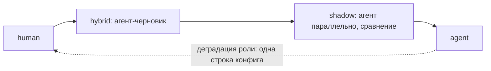

# Карта исполнителей: не-агентные исполнители ролей — отложено

Статус: **отложено** (стратегический дизайн; в объём фаз A–C
не входит). Действующая часть: роль = контракт «вход-артефакты →
выход-артефакты + гейты», исполнитель — деталь конфигурации
(roles.yaml, executor); одна из трёх осей вариативности per-target
(ADR-0003 п.11). Состояние awaiting_human реализуется в фазе C
(ADR-0003 п.7) для merge_gate: target-human — независимо от этого
документа.

**Триггер активации:** первая роль с executor ≠ agent (человек,
hybrid, external или shadow mode) — решение Оператора; отдельного
наблюдателя не требуется (конфигурационное событие).

Перенесено из docs/design.md §16 дословно (дистилляция 2026-08-24,
аудит v5 §3.1).

---

## 16. Модульность: карта исполнителей

> *Статус раздела: стратегический дизайн — план встраивания в живую команду.
> В объём реализации Фазы 0 и MVP не входит.*

Система встраивается в существующие процессы по частям — не «выключили
людей, включили агентов», а замена ролей по одной. Это возможно, потому что
архитектура модульна по построению: роли общаются материальными артефактами,
и оркестратор находится не в состоянии «вызвать агента-аналитика»,
а в состоянии «жду валидный SPEC.md». Кто положил артефакт — LLM за 3 минуты
или человек за 2 дня — конечному автомату безразлично: guards проверяют
артефакт, а не автора.

> **Роль = контракт (вход-артефакты → выход-артефакты + гейты).
> Исполнитель = деталь конфигурации.** Гейты и guards не зависят от карты
> исполнителей: человек-разработчик тоже не мержит без зелёного CI и аппрува
> ревьювера — политика §4 одна на всех.

### Четыре типа исполнителя

```yaml
# roles.yaml
roles:
  analyst:    { executor: human }      # человек в роли
  developer:  { executor: agent }      # как спроектировано
  reviewer:   { executor: hybrid }     # агент-черновик + человек утверждает
  verifier:   { executor: external }   # покупной продукт в роли
```

| Тип | Как работает | Когда применять |
|---|---|---|
| `agent` | эфемерный запуск по §6 | роль заслужила доверие |
| `human` | оркестратор назначает шаг человеку (карточка в инбокс/мессенджер) и ждёт артефакт | роль требует контекста, которого нет у системы (общение с бизнесом, политические решения) |
| `hybrid` | агент готовит черновик, человек правит и утверждает | самый недооценённый режим: человек-аналитик с готовым драфтом SPEC вместо пустого листа — путь наименьшего сопротивления при внедрении |
| `external` | роль исполняет вендорский продукт (ревьювер = Qodo/Bugbot, дежурный = Sentry Seer) | ответ на риск «вендоры догоняют» (§15.5): угроза превращается в опцию — вендор сделал роль лучше и дешевле → покупаем, контракт артефактов не меняется |

### Режимы встраивания

- **Агент в человеческой команде** — только разработчик агент, остальное
  люди (паттерн, который рынок уже нормализовал: Copilot coding agent
  в живых командах). Самый лёгкий старт.
- **Всё кроме разработки** — аналитик/ревьювер/верификатор агенты, пишут
  люди: агенты дают структуру (SPEC с критериями приёмки, независимые тесты)
  вокруг человеческого кода.
- **Человек-аналитик + агентный конвейер** — вероятная стартовая
  конфигурация для реальной команды: требования формирует человек,
  исполнение автономно.
- **Shadow mode** — агент работает параллельно с человеком в той же роли;
  его артефакт не используется, а сравнивается. Механизм заработка доверия
  перед заменой — и генератор данных для счётчиков доверия §4.

### Что нужно для честной модульности

1. **Валидация артефактов одинакова для всех.** Главная угроза — человек
   срезает углы («SPEC без критериев приёмки, и так понятно»), формат
   дрейфует, агенты ниже по конвейеру слепнут. Guard на шаблон заворачивает
   человеческий артефакт так же, как агентский.
2. **Мостик для неструктурированного входа:** крошечный агент-секретарь при
   human-ролях — человек пишет как привык (свободный текст, коммент в MR),
   секретарь конвертирует в формат артефакта и показывает на подтверждение.
3. **Тайминги по типу исполнителя:** таймаут агентского шага — минуты,
   человеческого — нет вообще: состояние `awaiting-human` (аналог
   `awaiting-approval`: ноль стоимости, по таймауту напоминание «задача ждёт
   аналитика 3 дня», не эскалация).
4. **Интерфейс человека = его привычные инструменты.** Не строить «кабинет
   исполнителя»: человек-ревьювер ревьюит MR как обычно — оркестратор
   слушает вебхук аппрува; человек-аналитик получает карточку в мессенджер
   и отвечает документом. Система невидима для человека в роли.
5. **Журнал фиксирует исполнителя шага** — для аудита и метрик: North Star
   считается по конфигурациям, а shadow mode даёт измеримое сравнение
   «агент vs человек в одной роли».

### Подводный камень и миграционная лестница

**Камень один, и он не технический:** один человек в конвейере задаёт
конвейеру человеческий темп — вставка human-аналитика превращает «запрос →
прод за часы» в «за дни». Это не баг, но выбор конфигурации должен его
учитывать: смешанный конвейер наследует худшую латентность своих звеньев,
и выгода агентов смещается из «скорость» в «качество структуры +
параллелизм задач».



Каждый переход подтверждается счётчиками доверия — тем же механизмом, что
эволюция гейтов (§4). Обратный ход дешёвый: агент-роль деградировала —
вернул `executor: human`, конвейер не заметил. Это и есть план внедрения
системы в живую команду.
