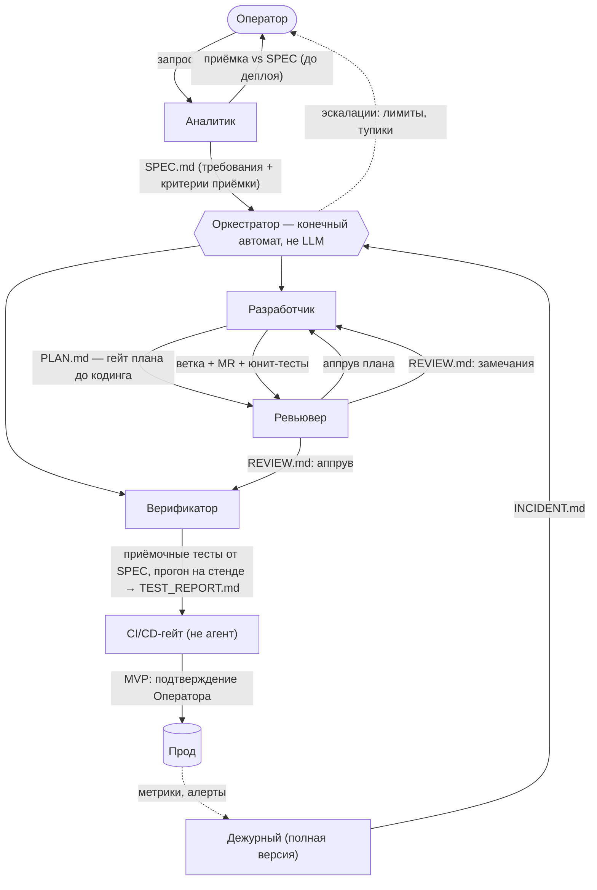
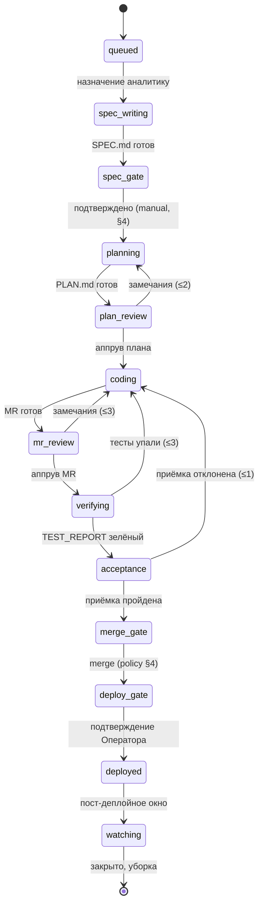

# Прод-контур: деплой, дежурный, watching, инциденты — отложено

Статус: **отложено**. Миссия текущего горизонта заканчивается
смердженным MR (пост-merge решение — ADR-0003 п.9: по merge задача
закрывается, треды смерженных MR система не читает). Релизы — процесс
целевого проекта, вне нашего FSM (ADR-0003 п.7).

**Триггер активации:** решение Оператора о расширении миссии
за смердженный MR (кандидатная точка — после go/no-go программы);
строка в docs/triggers.md. Смежный вариант «купить дежурного,
построить конвейер» (AI SRE: Resolve.ai, Cleric, Sentry Seer) —
см. docs/audits/market-2026-08.md, §15.5.

Ниже — секции, перенесённые из docs/design.md дословно
(дистилляция 2026-08-24, аудит v5 §3.1). Прод-роли, прод-хвост FSM
(deploy_gate → deployed → watching), реестр рисков «запрос → прод»
и прод-фрагменты визуального контура.

---

## Из design §1 — схема потока «запрос → прод»

## 1. Схема потока

Верификатор получает SPEC одновременно с разработчиком и пишет приёмочные
тесты **от требований, а не от кода** — иначе тесты фиксируют реализацию
вместе с её багами. Деплой — детерминированный пайплайн: агенту нечего решать
в `kubectl apply`.

---

## Из design §2 — прод-роли (строки таблицы ролей)

| Роль | Версия | Зачем выделена | Вход | Выход | Инструменты / права |
|---|---|---|---|---|---|
| **Деплой** | гейт | **Не агент.** CI/CD-пайплайн: сборка, миграции, выкатка, smoke, автооткат. В MVP — запускается подтверждением Оператора. | смерженный main + зелёные гейты | релиз в прод, запись о деплое | единственный обладатель прод-кредов |
| **Дежурный** | полная | Другой контур: живёт по алертам и расписанию, а не по задачам. Пост-деплойное окно наблюдения, триаж алертов. Откат — детерминированный, дежурный лишь решает «откатывать или нет». | алерты, метрики, логи, запись о деплое | INCIDENT.md → задача в очередь оркестратора; решение об откате | read-only прод-мониторинг, кнопка отката пайплайна |

---

## Из design §6 — целевой конечный автомат с прод-хвостом

### Единый конечный автомат задачи

Эта диаграмма — источник истины по состояниям; §1/§4/§14 — её проекции.
Оверлеи, доступные из любого состояния: `paused` (kill switch / panic mode),
`escalated` (исчерпан лимит — ждёт решения Оператора), `awaiting-approval` /
`awaiting-human` (ноль стоимости). Каждый переход = guards + policy (§4);
лимиты на рёбрах — глобальные счётчики задачи.

*Фаза 0:* реализовано семь состояний — `spec_writing → spec_gate → in_dev
→ review → acceptance → merge_gate → done` — плюс оверлеи `escalated`
и `killed`. `plan_review` слит с `review` (§2), а `verifying`, `deploy_gate`,
`deployed` и `watching` появятся вместе с верификатором, стендом и деплоем
(ADR-0001). Переход `review → acceptance` требует нового REVIEW.md: вердикт
ревьювера учитывается ровно один раз (T004, инвариант 13).

---

## Из design §13 — риски контура «запрос → прод»

## 13. Главные риски и чем закрыты

| Риск | Чем закрыт |
|---|---|
| **Зацикливание и сжигание бюджета** — агент крутит итерации всю ночь | жёсткие лимиты итераций, бюджет задачи с алертом на 70%, таймауты шага/задачи, детект «молчащего агента», kill switch |
| **Дрейф от запроса** — сделано не то, что просили | проверяемые критерии приёмки в SPEC, независимая интерпретация верификатором, финальная приёмка Аналитиком против исходного SPEC |
| **Плохой код доезжает до прода** | независимые гейты разной природы: ревью свежим контекстом, тесты от требований, CI (линт/SAST/юниты), smoke с автооткатом, в MVP — человек на кнопке деплоя |
| **Потеря контекста на передачах** — испорченный телефон между ролями | материальные артефакты стандартных форматов, минимум ролей в цепочке (5 в MVP), шаблоны в conventions-core |
| **Prompt injection и превышение прав** — агент начитался чужого текста и «решил» задеплоить | наименьшие привилегии по ролям (ревьювер read-only, разработчик без мержа) с отдельными токенами (§8), прод-креды только у пайплайна, песочницы с белым списком сети, мерж физически невозможен без гейтов. Открытые инъекционные цепочки закрыты отдельно: аппрув LLM-ревьювера никогда не единственный гейт для путей из no_paths; дежурный получает агрегаты и шаблоны алертов, не сырые прод-логи (лог-инъекция → ложные откаты = DoS доступности), «странный» триаж — эскалация, не действие; egress стенда ограничен как у песочниц |

*Фаза 0:* колонка «чем закрыт» перестала быть только текстом. Восемнадцать
инвариантов кодированы тестами и гоняются в CI на каждый push, а ослабить
защиту — тест, гейт, лимит, guard — вправе только Оператор отдельным ADR:
для роли конвейера такая правка не задача, а blocker в ревью (T010,
ADR-0002). Инварианты, которые тестом не выражаются, перечислены
в `docs/invariants.md` второй таблицей с честной причиной — не «забыли»,
а «проверяет ревьювер».

---

## Из design §14 — прод-фрагменты визуального контура

- **Мессенджер как канал MVP.** Для одного оператора инбокс решений идеально
  ложится в телеграм-бота: карточка эскалации с inline-кнопками,
  подтверждение деплоя с телефона. Радикально дешевле веб-дашборда и целиком
  закрывает главную поверхность. **Аутентификация обязательна:** бот
  принимает команды только с allowlist chat_id; критичные подтверждения
  (деплой, бюджет) — только из CLI или со вторым фактором (одноразовый код),
  телеграм-кнопки — для дешёвых «ок»: кнопка «выкатить в прод» во внешнем
  SaaS без этого = прод-доступ через компрометацию телеграм-аккаунта.

Также к прод-контуру относятся: строка «подтверждение деплоя»
в инбоксе решений, виджет расписаний обходов дежурного
(design §14 «Планировщик»), полный инцидент-runbook (минимальный —
к C2; полный — серверная эпоха, docs/triggers.md).
