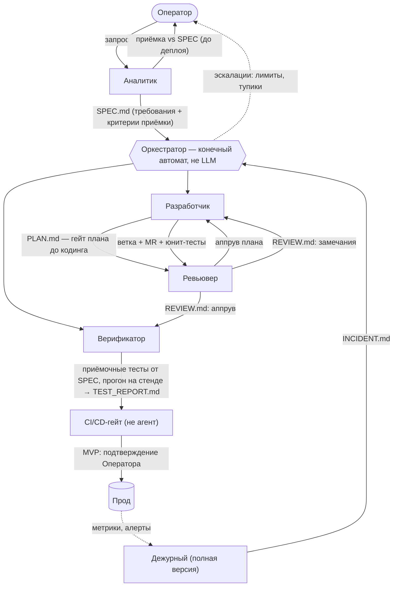
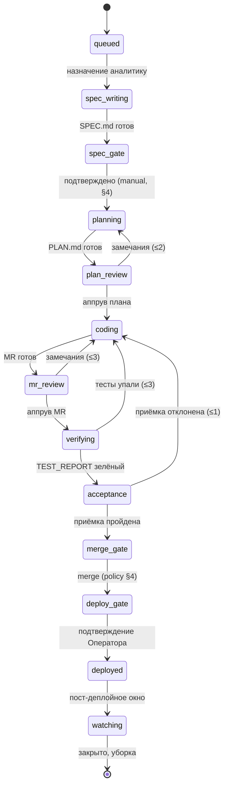
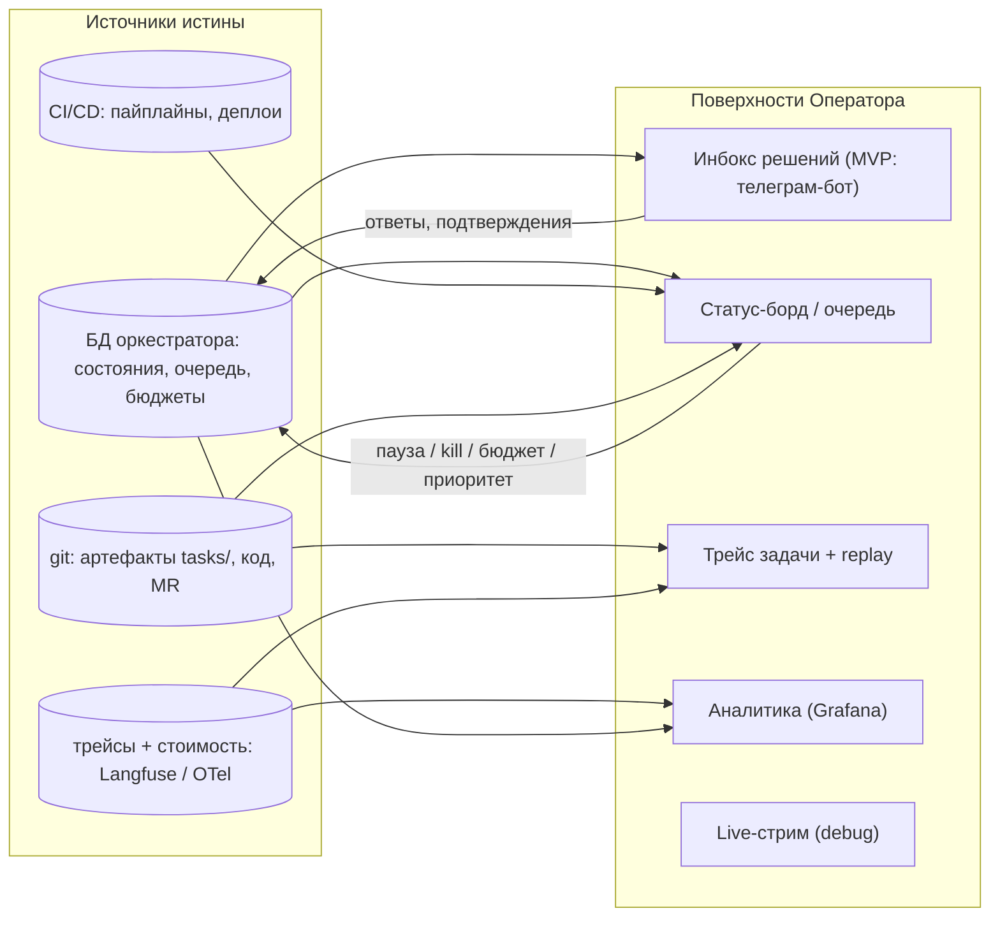
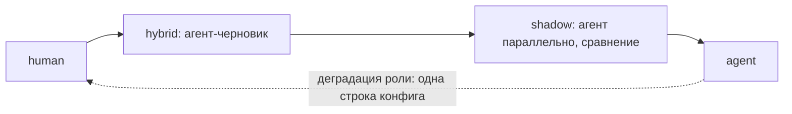

# Артель: агентская система «запрос оператора → прод»

Проект системы LLM-агентов, автономно доводящей запрос единственного человека
в контуре — Оператора — до работающего кода в проде. Спроектировано от свойств
агентов (контекст, потери на передачах, цена токенов), а не от аналогий
с человеческой командой.

> **Три несущих принципа**
> 1. Агент — только там, где нужно суждение. Всё детерминированное (деплой,
>    гейты, маршрутизация состояний) — код и пайплайны, не LLM.
> 2. Роль оправдана только свежим контекстом, конфликтом интересов
>    (проверяющий ≠ автор) или отдельными правами. Иначе — слить.
> 3. Git — шина артефактов. Агенты общаются документами в репозитории,
>    а не историей чата.

---

## 1. Схема потока



Верификатор получает SPEC одновременно с разработчиком и пишет приёмочные
тесты **от требований, а не от кода** — иначе тесты фиксируют реализацию
вместе с её багами. Деплой — детерминированный пайплайн: агенту нечего решать
в `kubectl apply`.

---

## 2. Роли

| Роль | Версия | Зачем выделена | Вход | Выход | Инструменты / права |
|---|---|---|---|---|---|
| **Оркестратор** | MVP | Единственный долгоживущий компонент. Конечный автомат состояний задачи; LLM-триаж входящих — вспомогательный классификатор, в ранних фазах не нужен (запрос оформляет Оператор). Никогда не исполняет работу сам — маршрутизирует, следит за лимитами, эскалирует. | события: артефакты ролей, вебхуки CI, алерты | назначения ролям, состояние задачи, эскалации | БД состояния, запуск агентов, каналы к Оператору, сервисный аккаунт мержа. **Не читает содержимое кода; единственное право записи в репо — merge MR, прошедшего guards + policy (§4).** |
| **Аналитик** | MVP | Единственный интерфейс к Оператору. Превращает размытый запрос в проверяемые требования; в конце — приёмка результата против них же. | запрос Оператора; на приёмке — TEST_REPORT со стенда (**приёмка до деплоя**; после деплоя — только smoke пайплайна) | SPEC.md: контекст, требования, критерии приёмки, «не входит» | чтение репозитория (read-only), диалог с Оператором |
| **Разработчик** | MVP | Исполнитель. Планирование — его первая фаза (PLAN.md как артефакт внутри задачи); отдельный архитектор — только в полной версии для крупных задач. | SPEC.md, замечания ревью, отчёты тестов | PLAN.md, ветка, код, юнит-тесты, MR | песочница, запись в свою ветку, запуск локальных тестов. **Не может мержить и деплоить.** |
| **Ревьювер** | MVP | Свежий контекст: не наследует ни одной строки контекста разработчика — только артефакты. Конфликт интересов встроен: его метрика — найденные дефекты. Работает в две фазы: **гейт плана** (дешёвая проверка PLAN.md до кодинга — декомпозиция, пропущенные требования; практика Jules Planning Critic: −9.5% фейлов задач) и полное ревью MR. | SPEC.md, PLAN.md, diff MR | аппрув плана; REVIEW.md: замечания с severity или аппрув-токен | read-only по коду, право поставить аппрув-метку в MR. **Не может править код.** |
| **Верификатор** | MVP | Проверяет систему против SPEC, не против кода. Пишет тесты до/параллельно разработке — независимая интерпретация требований. Верификация — только исполнением (прогон на стенде), никогда чтением кода: «поверхностная верификация» — причина отказов №1 у мультиагентных систем. Где критерии позволяют — property-based: из критерия извлекается свойство и обстреливается рандомизированными кейсами (подход Kiro) — защита от кода, проходящего тесты случайно. | SPEC.md; после аппрува — собранная ветка на стенде | приёмочные тесты (в репо), TEST_REPORT.md | стенд (деплой ветки через CI), запись только в каталог тестов |
| **Деплой** | гейт | **Не агент.** CI/CD-пайплайн: сборка, миграции, выкатка, smoke, автооткат. В MVP — запускается подтверждением Оператора. | смерженный main + зелёные гейты | релиз в прод, запись о деплое | единственный обладатель прод-кредов |
| **Дежурный** | полная | Другой контур: живёт по алертам и расписанию, а не по задачам. Пост-деплойное окно наблюдения, триаж алертов. Откат — детерминированный, дежурный лишь решает «откатывать или нет». | алерты, метрики, логи, запись о деплое | INCIDENT.md → задача в очередь оркестратора; решение об откате | read-only прод-мониторинг, кнопка отката пайплайна |
| **Безопасник** | полная | В MVP — не роль, а гейт (SAST/зависимости в CI). Агент появляется, когда отчёты гейтов требуют суждения: триаж находок, false positives, задачи на фиксы через оркестратор. | отчёты SAST/SCA, diff MR | вердикт по находкам, задачи на фиксы | read-only код и отчёты |
| **Куратор знаний** | полная | Замыкает обучение системы: из закрытых задач, ревью и инцидентов обновляет конвенции и скилы. В MVP это делает разработчик по замечанию ревьювера. | закрытые задачи, REVIEW.md, постмортемы | обновления конвенций, ADR, скилов | запись в docs/ и skills/ через обычный MR |

Чего здесь **нет** и почему: БА и СА слиты в одного Аналитика (две
последовательные документо-генерирующие роли — испорченный телефон);
«декомпозитор ТЗ» — фаза планирования разработчика, а не роль; «девопс» —
это CI/CD, настроенный заранее, плюс дежурный для инцидентов пайплайна.

---

## 3. Артефакты и связи

| Артефакт | Автор → потребитель | Содержимое |
|---|---|---|
| `tasks/<id>/REQUEST.md` | Оператор → Аналитик | сырой запрос + переписка уточнений |
| `tasks/<id>/SPEC.md` | Аналитик → Разработчик, Верификатор, Ревьювер | контекст, требования, **проверяемые критерии приёмки**, явное «не входит» |
| `tasks/<id>/PLAN.md` | Разработчик → Ревьювер, Оркестратор | декомпозиция на независимо проверяемые единицы размера MR (не «минимальные операции») |
| ветка + MR | Разработчик → Ревьювер | код, юнит-тесты, описание изменений |
| `tasks/<id>/REVIEW.md` | Ревьювер → Разработчик, Оркестратор | замечания с severity и привязкой к строкам, либо аппрув |
| `tasks/<id>/TEST_REPORT.md` | Верификатор → Аналитик, Оркестратор | прогон приёмочных тестов на стенде, матрица «критерий → статус» |
| запись о деплое | пайплайн → Дежурный, Аналитик | версия, время, diff релиза, ссылка на smoke |
| `incidents/<id>.md` | Дежурный → Оркестратор | симптомы, триаж, связь с деплоем, решение об откате |

Каждая передача между ролями материальна: файл в репозитории задачи.
Это одновременно протокол общения, чекпоинт восстановления и трейс
для наблюдаемости — три задачи одним механизмом.

---

## 4. Циклы обратной связи и эскалации

| Событие | Реакция | Лимит | После лимита |
|---|---|---|---|
| Гейт плана отклонил PLAN.md | Разработчик перепланирует с учётом замечаний | 2 итерации | эскалация Оператору (обычно сигнал плохого SPEC) |
| Ревью отклонило MR | Разработчик правит по REVIEW.md, новый прогон ревью | 3 итерации | эскалация Оператору с полным трейсом разногласия |
| Приёмочные тесты упали | Разработчик фиксит, повторный прогон (ревью — только если diff нетривиален) | 3 итерации | эскалация Оператору |
| Разработчику неясен SPEC | вопрос Аналитику, тот отвечает или идёт к Оператору | 1 раунд | Оператор |
| Верификатор и SPEC расходятся с кодом | вердикт Аналитика: чинить код или уточнять SPEC | 1 раунд | Оператор |
| Приёмка отклонила результат | вердикт Аналитика: доработка (возврат в разработку) или уточнение SPEC | 1 итерация | Оператор: деплоить как есть / доработать / закрыть |
| Деплой упал / smoke красный | автооткат пайплайном, задача разработчику | авто | Оператор уведомлён всегда |
| Инцидент в проде | Дежурный: триаж → откат (детерминир.) → INCIDENT.md → задача в очередь | SLA триажа | Оператор при любом откате |
| Превышен бюджет / таймаут задачи | пауза, состояние сохранено (артефакты в git) | жёсткий | Оператор решает: добавить бюджет / закрыть |

Правило: **ни одного незамкнутого цикла**. У каждой ошибки есть путь
обработки, у каждого пути — числовой лимит, после лимита — всегда Оператор,
никогда «ещё одна попытка». Оператора дёргают в трёх случаях: неоднозначность
требований, исчерпанный лимит, решение о проде.

**Все счётчики итераций — глобальные на задачу:** повторный вход в фазу
(фикс после упавших тестов → ре-ревью) не сбрасывает их — иначе попарное
зацикливание ревью↔тесты через разработчика легально. И честно о guards:
они проверяют *структуру* артефакта (frontmatter, обязательные секции —
простой скрипт); содержательность гарантируется ручным гейтом SPEC и свежим
контекстом потребителей, не guards.

### Политика гейтов: авто / ручное подтверждение на каждом переходе

Третий столп управления рядом с лимитами и эскалациями. Это не глобальный
«режим системы» (грубый инструмент: в ручном Оператор тонет в подтверждениях,
в авто теряет контроль везде сразу), а **политика на каждом переходе FSM**.
Гейты — плановые остановки, эскалации — исключения; они не смешиваются:
эскалация всегда ручная по природе.

Каждый переход имеет два независимых слоя:

- **Guards — автоматические условия, неотключаемые.** CI зелёный, артефакт
  валиден по шаблону, лимиты не исчерпаны. Это физика системы: даже в полном
  авто нельзя смержить с красным CI.
- **Policy — кто даёт разрешение:** `auto` (guards прошли → переход),
  `manual` (карточка в инбокс Оператора → ждём), `conditional` (авто при
  выполнении предикатов, иначе ручное).

> **Два жёстких правила.**
> 1. Молчание ≠ согласие: ручной гейт по таймауту не «автопроходит» — задача
>    висит в `awaiting-approval`, жжёт ноль токенов; по таймауту только
>    напоминание.
> 2. Policy проверяет оркестратор, не агент: агент не знает режима гейта —
>    он всегда просто отдаёт артефакт. Иначе появляется вектор «агент решил,
>    что можно» — источник канонических инцидентов рынка.

| Переход | Дефолт MVP | Почему | Куда может уехать |
|---|---|---|---|
| Запрос → SPEC принят в работу | **manual** | самый дешёвый гейт: 2 минуты чтения SPEC экономят бюджет задачи «не про то» | conditional (авто для багфиксов) |
| SPEC → разработка | auto | SPEC подтверждён — незачем подтверждать старт | — |
| Гейт плана (ревьювер) | auto | агентский гейт, Оператора тут нет | — |
| Ревью MR → merge | **manual** первое время | реальный merge rate агентных PR 43–83% — доверие зарабатывается | **conditional** — главный кандидат |
| Merge → deploy prod | **manual** | решение о проде — Оператора (§12) | авто со стоп-краном по счётчику доверия |
| Откат при инциденте | **auto** | асимметрия направлений: движение в безопасную сторону не ждёт человека — ждать при пожаре вреднее | — |
| Увеличение бюджета / лимитов | **manual всегда** | тот случай, ради которого лимиты существуют | никогда |

Асимметрия по строкам — принцип: **откат — авто, выкат — вручную**.
Подтверждение нужно там, где действие необратимо или направлено наружу;
обратимые движения в безопасную сторону автономны всегда.

**Conditional — рабочая точка.** Политика как код, в git, ревьюится как код:

```yaml
# gates.yaml
merge:
  mode: conditional
  auto_if:
    - diff_lines < 200
    - no_migrations
    - no_paths: ["**/auth/**", "ci/", "**/payments/**",
                 "gates.yaml", "roles.yaml", ".gitlab-ci.yml",
                 "templates/", "skills/"]  # конфиги системы — всегда вручную
    - review_major_findings == 0
    - acceptance_tests_first_pass
  else: manual
```

Рутинный багфикс проезжает сам; всё, что трогает миграции, auth или прошло
ревью со скрипом, приходит карточкой Оператору. Каждое авто-прохождение
логируется вместе с доказательствами предикатов — аудит «почему это уехало
без меня» = один запрос. (Это autonomy slider Factory.ai, воспроизведённый
прозрачно.)

**Защита политики от самой системы:** policy-движок читает `gates.yaml`
только из main — версия из ветки MR игнорируется; конфиги системы
(gates.yaml, roles.yaml, CI, шаблоны, скилы) всегда в no_paths. Иначе
агент-разработчик может ослабить политику мержа собственным MR, и при
conditional с diff < 200 строк такой MR сам себе откроет auto-merge.

**Эволюция доверия — данными.** Оркестратор ведёт по каждому гейту счётчик
«подтверждено без изменений подряд»; по порогу система сама предлагает
перевести гейт в auto или ослабить предикаты — карточкой в тот же инбокс.
Решает человек, подсказывает статистика. Обратный ход автоматический:
отклонённый merge сбрасывает счётчик, инцидент откатывает гейт в manual.

**Три уровня переопределения:** глобальный дефолт (`gates.yaml`) → на задачу
(Оператор при постановке: «рискованное — всё вручную» / «косметика — всё
авто», кроме гейтов «никогда») → **panic mode**: одна команда переводит все
гейты всех задач в manual, не убивая работу.

**Антипаттерн — усталость от подтверждений.** Много ручных гейтов → Оператор
штампует «ок» не глядя — хуже честного авто, потому что создаёт иллюзию
контроля (alarm fatigue). Противоядия: мало осмысленных гейтов; карточка
несёт выжимку (diff-статистика, находки ревью, отчёт тестов), а не голое
«подтверди»; метрика «медианное время на подтверждение» — упала до секунд →
гейт пора в conditional либо карточка плохая.

---

## 5. Скилы ролей

Конфигурация роли = **короткий системный промпт** (личность, цель, границы —
«кто ты и чего не делаешь») + **набор скилов** (процедурные знания,
подгружаемые модули) + **права**. Ни один процедурный текст не живёт в двух
промптах — повторяющееся вынесено в общий скил и правится в одном месте.

### Матрица «роль × скил»

Роли: АН — аналитик, РЗ — разработчик, РВ — ревьювер, ВФ — верификатор,
ДЖ — дежурный, БЗ — безопасник, КЗ — куратор. `●` — роль MVP,
`(●)` — роль полной версии.

| Скил | Слой | АН | РЗ | РВ | ВФ | ДЖ | БЗ | КЗ |
|---|---|---|---|---|---|---|---|---|
| `conventions-core` | базовый | ● | ● | ● | ● | (●) | (●) | (●) |
| `escalation-rules` | базовый | ● | ● | ● | ● | (●) | (●) | (●) |
| `memory-access` | базовый | ● | ● | ● | ● | (●) | (●) | (●) |
| `codebase-map` | общий | ● | ● | ● | ● | — | (●) | — |
| `git-workflow` | общий | — | ● | ● | ● | — | — | (●) |
| `ci-pipeline` | общий | — | ● | — | ● | (●) | — | — |
| `stand-management` | общий | — | — | — | ● | (●) | — | — |
| `spec-writing` | ролевой | ● | — | — | — | — | — | — |
| `acceptance-criteria` | общий | ● | — | — | ● | — | — | — |
| `coding-standards` | ролевой | — | ● | ● | — | — | — | — |
| `testing-strategy` | общий | — | ● | — | ● | — | — | — |
| `review-checklist` | ролевой | — | — | ● | — | — | — | — |
| `security-checklist` | общий | — | — | ● | — | — | (●) | — |
| `deploy-runbook` | ролевой | — | — | — | — | (●) | — | — |
| `incident-triage` | ролевой | — | — | — | — | (●) | — | — |
| `knowledge-curation` | ролевой | — | — | — | — | — | — | (●) |

### Реестр скилов

| Скил | Назначение | Содержимое | Активация |
|---|---|---|---|
| `conventions-core` | единый язык системы | форматы всех артефактов (шаблоны SPEC/PLAN/REVIEW/…), структура `tasks/`, стиль коммуникации | всегда в контексте |
| `escalation-rules` | когда остановиться | лимиты итераций, что считается тупиком, как оформить эскалацию Оператору | всегда в контексте |
| `memory-access` | работа с общей памятью | где лежат конвенции/ADR/постмортемы, как искать прецеденты прошлых задач | по триггеру |
| `codebase-map` | ориентация в проекте | карта модулей, точки входа, где что искать; генерируется и обновляется автоматически | по триггеру |
| `git-workflow` | единый флоу веток | именование веток, формат коммитов/MR, rebase-политика, работа с worktree | по триггеру |
| `ci-pipeline` | что гоняет CI | стадии пайплайна, как читать падения, как запустить прогон/деплой ветки на стенд | по триггеру |
| `stand-management` | стенды | какие стенды есть, как занять/освободить, наполнение тестовыми данными | по триггеру |
| `spec-writing` | качество требований | шаблон SPEC, чек-лист полноты, техника вопросов Оператору, обязательное «не входит» | всегда (у Аналитика) |
| `acceptance-criteria` | проверяемость | как писать критерии, по которым можно написать тест; примеры хороших/плохих; извлечение свойств для property-based тестов | всегда (у обоих) |
| `coding-standards` | единый стиль кода | стайлгайд, паттерны проекта, эталонные классы, антипаттерны из прошлых ревью | всегда (у Разработчика) |
| `testing-strategy` | пирамида тестов | что покрывать юнитами vs приёмочными, фикстуры, как гонять локально | по триггеру |
| `review-checklist` | полнота ревью | два чек-листа: гейт плана (декомпозиция, покрытие требований SPEC) и ревью MR (соответствие SPEC, корректность, простота, тесты); формат замечаний с severity | всегда (у Ревьювера) |
| `security-checklist` | безопасность в ревью | OWASP-минимум для стека проекта, работа с секретами, чтение SAST-отчётов | по триггеру |
| `deploy-runbook` | процедура выката/отката | что смотреть в окно после деплоя, критерии отката, как дёрнуть откат | всегда (у Дежурного) |
| `incident-triage` | разбор инцидентов | дерево триажа: симптом → куда смотреть; шаблон INCIDENT.md; связь алертов с деплоями | по алерту |
| `knowledge-curation` | обучение системы | как из закрытой задачи извлечь урок: обновить конвенцию, скил, добавить антипаттерн | по расписанию |

Критерий достаточности набора: роль закрывает свою зону ответственности и все
свои ветки ошибок, не запрашивая знаний у других ролей. Скилы «всегда
в контексте» — короткие (жгут токены каждый запуск); тяжёлое содержимое —
только по триггеру.

---

## 6. Runtime: как агенты живут

**Модель запуска.** Эфемерные агенты на шаг — модель CI-джобы: контейнер
поднялся, получил артефакты, отработал, закоммитил результат, умер. Дёшево,
воспроизводимо, нечему течь. Единственный долгоживущий компонент —
оркестратор (лёгкий сервис: БД состояния + подписка на события). Дежурный —
тоже эфемерный: запуск по алерту и по расписанию.

**Триггеры.** Запрос Оператора (чат/CLI) → оркестратор. Вебхуки CI (пайплайн
зелёный/красный, MR обновлён) → оркестратор. Алерты мониторинга → дежурный.
Расписание → дежурный (обход) и куратор знаний. Каждый триггер порождает шаг
конечного автомата, а не «будит» агента в вечном цикле. Вебхуки — основной
канал, поллинг статусов CI — фоллбек: потерянная доставка вебхука не должна
вешать задачу до суточного алерта.

**Очередь и параллелизм.** Очередь задач — таблица в БД оркестратора.
MVP: задачи строго последовательно (одна активная), внутри задачи роли —
по конвейеру. Полная версия: N параллельных задач, изоляция через
ветки/worktree; конфликт за файлы решается на уровне планирования
(оркестратор не пускает в работу задачи с пересекающимися зонами).

**Устойчивость.** Каждый шаг идемпотентен: результат — артефакт в git,
коммит атомарен. Упал агент посреди шага — шаг перезапускается с чистого
контейнера от последнего артефакта; ничего «в памяти» не живёт. Чекпоинт =
последний закоммиченный артефакт. Два уровня отказов обрабатываются
по-разному: **транзиентные** (rate limit, таймаут API, обрыв сети) — ретраи
с экспоненциальным бэкоффом внутри шага, не считаются итерацией;
**содержательные** — циклы §4. Оркестратор ведёт журнал шагов в БД (шаг,
статус, попытки, стоимость) — транзиентные ошибки без журналирования —
главный источник развала таких систем в проде (Codex, Replit Agent и агенты
Cursor не зря работают на Temporal).

**Завершение и уборка.** Задачу закрывает оркестратор после приёмки
Аналитиком. Уборка автоматическая: ветка смержена и удалена, стенд
освобождён, песочницы уничтожены, артефакты остаются в `tasks/<id>/`
как история.

**Потолки.** Таймаут шага (например 30 мин), таймаут задачи (часы, не дни),
бюджет токенов/денег на задачу, лимиты итераций циклов (§4). Всё — жёсткие:
по достижении пауза и эскалация, не деградация. Kill switch Оператора:
остановить шаг / задачу / всю систему одной командой. Отдельные состояния
`awaiting-approval` (ручной гейт §4) и `awaiting-human` (шаг у
человека-исполнителя §16): задача стоит с нулевой стоимостью сколько угодно,
таймаут задачи на них не распространяется — по таймауту только напоминание,
никогда автопроход.

### Единый конечный автомат задачи



Эта диаграмма — источник истины по состояниям; §1/§4/§14 — её проекции.
Оверлеи, доступные из любого состояния: `paused` (kill switch / panic mode),
`escalated` (исчерпан лимит — ждёт решения Оператора), `awaiting-approval` /
`awaiting-human` (ноль стоимости). Каждый переход = guards + policy (§4);
лимиты на рёбрах — глобальные счётчики задачи.

---

## 7. Наблюдаемость самих агентов

Не путать с мониторингом прода (это вотчина дежурного). Здесь — прозрачность
самой системы для одного человека, который ею управляет.

| Что измеряем | Зачем | Где смотрим | Алерт |
|---|---|---|---|
| **North Star: доля задач, дошедших до прода без правок человека** | единственная честная мера автономности — бенчмарки систематически врут (merge rate реальных агентных PR у лидеров рынка 43–83% при 70%+ на SWE-bench) | дашборд, помесячно | падение тренда |
| Трейс задачи: цепочка запусков, решения, артефакты, итерации | разбор «почему система сделала так» | трейс-вьювер (Langfuse/OTel) + сами артефакты в git | — |
| Стоимость задачи (токены, $) | экономика, обнаружение разгона | дашборд, разбивка по ролям | задача превысила 70% бюджета |
| Время прохождения запрос→прод | здоровье конвейера | дашборд | нет нового артефакта > X часов («застряла») |
| Доля задач с эскалацией | качество SPEC и лимитов | дашборд, еженедельно | рост тренда |
| Доля отклонённых ревью / итераций на MR | качество разработчика и скилов | дашборд | стабильно у потолка лимита → скилы деградировали |
| Прохождение приёмочных тестов с первого раза | качество связки SPEC ↔ реализация | дашборд | — |
| Молчащий агент | зависание запуска | — | шаг жив, но нет вывода > N мин → kill + перезапуск (не более 2 — системная причина вроде истёкшего токена ретраями не лечится), дальше эскалация |
| **Heartbeat оркестратора** | мёртвый оркестратор производит пустой инбокс, неотличимый от «всё хорошо» | внешний мониторинг (Grafana) | нет heartbeat > 5 мин |

**Пульт Оператора:** список задач с состояниями конечного автомата,
по клику — трейс и артефакты; кнопки пауза / возобновить / убить / добавить
бюджет / **откатить задачу к шагу N** (перемотка по git-чекпоинтам без
пересжигания бюджета — идея checkpoints из Kiro). В MVP это может быть CLI +
страница со статусами; полная версия — веб-дашборд.

**Определение «правки» для North Star:** изменение артефакта или кода
человеком после сдачи роли; аппрув на ручном гейте правкой не считается.
Исполнитель каждого шага пишется в журнал с первого дня (одно поле) — иначе
метрика несобираема ровно в период калибровки доверия, когда нужнее всего.

---

## 8. Настроить до запуска

- **Репозиторий:** защита main — мерж только при зелёном CI + аппрув-метке
  ревьювера; шаблоны артефактов в `templates/`; структура `tasks/`,
  `docs/adr/`, `skills/`.
- **Политика гейтов:** `gates.yaml` в репо + проверка policy в оркестраторе;
  авто-мерж выполняет только сервисный аккаунт оркестратора после
  policy-check — branch protection остаётся второй, физической линией защиты.
- **Идентичности ролей:** отдельный токен/аккаунт на каждую роль
  с минимальными правами — без этого разделение прав §2 существует только
  в промптах. Там, где аппрувы не блокируют мерж нативно (GitLab Free,
  GitHub Free private): enforcement = CI-джоба, проверяющая *автора*
  аппрув-метки (именно аккаунт ревьювера), + protected main, куда мержит
  только сервисный аккаунт оркестратора.
- **CI:** линт, юнит-тесты, SAST + проверка зависимостей, сборка — на каждый
  MR. Красный CI = разработчик не может передать MR ревьюверу.
- **Стенд:** автодеплой ветки по запросу верификатора, тестовые данные,
  сброс в исходное состояние.
- **Прод-пайплайн:** сборка → миграции → выкатка → smoke → автооткат при
  красном smoke. Прод-креды — только внутри пайплайна, агентам не выдаются
  никогда.
- **Песочницы:** контейнер-образ агента (инструменты, доступ к репо,
  без сети наружу кроме API моделей и белого списка).
- **Секреты:** vault; агенту в контейнер попадает только его минимальный
  набор.
- **Оркестратор:** БД состояния, приём вебхуков, счётчик бюджета,
  kill switch.
- **Наблюдаемость:** экспорт трейсов и стоимости с первого дня — доустроить
  дашборд потом можно, а восстановить историю нельзя.

---

## 9. Память и знания

| Что помним | Где лежит | Кто обновляет |
|---|---|---|
| Конвенции, стайлгайд, антипаттерны | `docs/conventions/` + скил `coding-standards` | MVP: разработчик по замечанию ревью; полная: куратор |
| Архитектурные решения | `docs/adr/` | разработчик при значимом выборе в PLAN |
| История задач с артефактами | `tasks/<id>/` | появляется само по ходу работы |
| Карта кодовой базы | скил `codebase-map` | генератор-скрипт в CI после мержей в main; провал регенерации — алерт, не молчание (устаревшая карта = уверенно неверная навигация агентов, проявится ростом итераций без видимой причины) |
| Постмортемы | `incidents/` | дежурный |

Вся память — файлы в git: версионируется, ревьюится тем же конвейером,
доступна любой роли через скил `memory-access`. Отдельная векторная БД в MVP
не нужна — grep по структурированным документам достаточен; добавлять
по триггеру «поиск прецедентов стал узким местом».

---

## 10. Экономика

Основные статьи расхода: **итерации разработчика** (самые длинные контексты,
много инструментальных вызовов) и **контекст ревьювера** (читает diff + SPEC
+ кодовую базу). Схема ограничивает их так:

- Эфемерные роли получают минимальный контекст: свои артефакты + скилы
  по триггеру, а не историю всей задачи.
- Лимиты итераций (§4) ограничивают *структуру* худшего случая, но не
  стоимость: внутри шага расход не ограничен ничем, кроме бюджета. Честно:
  потолок задачи = её денежный бюджет; лимиты лишь не дают худшему случаю
  быть бесконечным.
- Бюджет на задачу — жёсткий, с алертом на 70%.
- Разные модели по ролям: сильная — разработчику и ревьюверу, средняя —
  аналитику и верификатору, дешёвая — триажу оркестратора и суммаризациям.
- Кэширование промптов работает *внутри шага* (многоходовый цикл агента —
  и есть основной расход); между эфемерными шагами, разделёнными CI
  и ожиданиями, кэш чаще холодный из-за TTL — межшаговую экономию в расчёты
  не закладывать.
- **Не параллелить исполнителей внутри задачи.** Данные Anthropic по их
  мультиагентной системе: мультиагентность ≈ 15x токенов и плохо подходит
  для тесно связанного кодинга — агенты дублируют работу и оставляют дыры
  на стыках. Последовательный конвейер ролей — не компромисс, а оптимум;
  параллелизм — только между независимыми задачами.

---

## 11. Анализ стека

| Критерий | A: Claude Agent SDK + тонкий оркестратор | B: LangGraph + Langfuse | C: Temporal + агенты поверх API |
|---|---|---|---|
| Скорость MVP | ●●● агент-кодер, скилы (SKILL.md), песочницы, MCP — из коробки; писать только конечный автомат оркестратора | ●●○ граф быстро, но инструменты кодинга (git, exec, редактирование) собирать самому | ●○○ максимум кода до первого результата |
| Контроль циклов и лимитов | ●●○ в самописном оркестраторе — полный; внутри шага агент автономен (лечится таймаутом и бюджетом на шаг) | ●●● граф с явными рёбрами, чекпоинты, прерывания — сильная сторона | ●●● индустриальная durability, ретраи, версионирование workflow |
| Наблюдаемость | ●●○ хуки + OTel-экспорт, стоимость видна; трейс-вьювер добавить (Langfuse) | ●●● LangSmith/Langfuse нативно | ●●○ workflow-история отличная, LLM-специфику строить самому |
| Vendor lock-in | привязка к Anthropic; смягчение — артефакты в git и состояние в своей БД, мигрируемо | model-agnostic | model-agnostic |
| Стоимость эксплуатации | низкая: сервис + CI | средняя: свой рантайм графа + тулинг | высокая: кластер Temporal + воркеры |
| Порог для одного мейнтейнера | ●●● низкий | ●●○ средний | ●○○ высокий |

> **Рекомендация: вариант A для MVP.** Домен — кодинг, и готовый агент-кодер
> с нативными скилами закрывает самую дорогую часть работы; масштаб — один
> мейнтейнер. Изоляция — контейнеры (образ агента + CI-раннеры), шина
> артефактов — git, состояние — SQLite/Postgres у оркестратора, трейсы —
> Langfuse или OTel с первого дня.
>
> **Триггеры пересмотра:** нужен сложный параллелизм или workflow длиннее
> суток с гарантиями → C (Temporal как оркестратор, агенты остаются);
> требование мультивендорности моделей или тонкого управления графом → B.
> Благодаря «артефакты в git + состояние в БД» миграция меняет оркестратор,
> а не систему.
>
> **Прослойка над агентным рантаймом — обязательна.** Горизонт жизни
> вендорских агентных продуктов ~год: за 2025–2026 умерли или поглощены
> Copilot Workspace, Amazon Q Developer, Gemini CLI, Codegen, Sweep-бот.
> Интерфейс «роль: вход-артефакты → выход-артефакты» — свой; чем роль
> исполняется (Agent SDK, CLI-агент, голый API) — деталь за прослойкой,
> заменяемая без перестройки системы.
>
> Отдельно: CrewAI/AutoGen-класс отвергнут осознанно — быстрые демо,
> но слабый контроль циклов и лимитов, а именно они здесь несущие.

---

## 12. Фаза 0 → MVP → полная версия

### Фаза 0 — MVP-минус: первый замкнутый цикл за 2–3 недели

Итог адверсариального ревью: MVP ниже — это месяцы обвязки, а система,
не породившая ни одной задачи, умирает недостроенной. Перед MVP —
минимальный срез:

- Роли-агенты только две: разработчик и ревьювер. SPEC.md пишет сам Оператор
  по шаблону; приёмку по критериям SPEC делает Оператор перед мержем
  (верификатор и стенд отложены).
- Оркестратор = CLI-скрипт: FSM в SQLite, поллинг CI вместо вебхуков;
  все гейты ручные и захардкожены — без gates.yaml и policy-движка.
- Телеграм — только уведомления; подтверждения из CLI.
- Скилы: `conventions-core`, `escalation-rules`, `coding-standards`,
  `review-checklist`; codebase-map — статичный рукописный файл.
- **Не режется даже здесь:** отдельные токены на роль (§8), лимиты
  (итерации, бюджет, таймауты), журнал шагов с полями
  шаг/роль/исполнитель/попытки/токены/$.
- **Критерий выхода:** 5 реальных задач прошли цикл «запрос → смерженный
  MR». Только после этого строятся верификатор со стендом, бот с кнопками
  и policy-движок.

### MVP — цикл замыкается end-to-end

- Роли: оркестратор, аналитик, разработчик, ревьювер, верификатор.
- Деплой: CI-пайплайн, запуск — подтверждением Оператора.
- Runtime: эфемерные запуски, задачи последовательно, таймауты + бюджет +
  kill switch.
- Наблюдаемость: экспорт трейсов и стоимости, статус-страница/CLI.
- Скилы: базовый слой + `git-workflow`, `codebase-map`, `ci-pipeline`,
  `stand-management`, `testing-strategy` + ядро ролевых (`spec-writing`,
  `coding-standards`, `review-checklist`, `acceptance-criteria`) —
  без stand-management и testing-strategy верификатор в MVP не выполнит
  свою функцию.

**Осознанно принятые риски:** за продом смотрит Оператор (нет дежурного);
безопасность = SAST-гейт без триажа; нет параллелизма; знания обновляются
вручную.

### Полная версия — добавлять по триггеру, не «потом»

- **Параллелизм задач** — когда очередь стабильно копится (>3 задач
  в ожидании); вместе с ним обязателен **merge queue** — сериализация мержей
  с прогоном гейтов на актуальном main (главные грабли Gas Town — хаос
  merge-очередей).
- **Дежурный** — когда инцидент после деплоя заметили люди раньше системы.
- **Безопасник** — когда SAST-гейт шумит (частые false positives) или
  пропустил реальную находку.
- **Куратор знаний** — когда ревью повторно ловит одни и те же антипаттерны.
- **Архитектор-планировщик** — когда крупные задачи разваливаются на этапе
  PLAN (лимит итераций из-за плохой декомпозиции).
- **Эволюция гейтов в auto/conditional** (обобщение автодеплоя
  со стоп-краном) — гейт за гейтом, когда его счётчик доверия
  «N подтверждений подряд без правок» достигает порога; предлагает система,
  решает Оператор (§4).
- **Веб-дашборд, векторный поиск прецедентов** — по боли, соответственно
  росту.

---

## 13. Главные риски и чем закрыты

| Риск | Чем закрыт |
|---|---|
| **Зацикливание и сжигание бюджета** — агент крутит итерации всю ночь | жёсткие лимиты итераций, бюджет задачи с алертом на 70%, таймауты шага/задачи, детект «молчащего агента», kill switch |
| **Дрейф от запроса** — сделано не то, что просили | проверяемые критерии приёмки в SPEC, независимая интерпретация верификатором, финальная приёмка Аналитиком против исходного SPEC |
| **Плохой код доезжает до прода** | независимые гейты разной природы: ревью свежим контекстом, тесты от требований, CI (линт/SAST/юниты), smoke с автооткатом, в MVP — человек на кнопке деплоя |
| **Потеря контекста на передачах** — испорченный телефон между ролями | материальные артефакты стандартных форматов, минимум ролей в цепочке (5 в MVP), шаблоны в conventions-core |
| **Prompt injection и превышение прав** — агент начитался чужого текста и «решил» задеплоить | наименьшие привилегии по ролям (ревьювер read-only, разработчик без мержа) с отдельными токенами (§8), прод-креды только у пайплайна, песочницы с белым списком сети, мерж физически невозможен без гейтов. Открытые инъекционные цепочки закрыты отдельно: аппрув LLM-ревьювера никогда не единственный гейт для путей из no_paths; дежурный получает агрегаты и шаблоны алертов, не сырые прод-логи (лог-инъекция → ложные откаты = DoS доступности), «странный» триаж — эскалация, не действие; egress стенда ограничен как у песочниц |

---

## 14. Визуальный контур Оператора

Наблюдаемость (§7) отвечает «что измерять»; этот раздел — «через что один
человек этим управляет». Поверхности выводятся из вопросов, которые Оператор
реально задаёт системе, а не из привычных человеческих инструментов.

> **Несущее правило контура:** источник истины — БД оркестратора + git.
> Любой визуальный инструмент — read-only проекция. Единственный ввод через
> UI — явные контролы: пауза, kill, бюджет, приоритет, ответ на эскалацию.
> Антипаттерн — сделать трекер местом координации агентов: появляется
> двусторонний синк, источник истины расползается.

### Пять поверхностей

| Вопрос Оператора | Поверхность | Суть |
|---|---|---|
| **«Где я нужен?»** | Инбокс решений — **главная поверхность** | Очередь карточек-решений по трём поводам эскалации (§4): неоднозначность, исчерпанный лимит, подтверждение деплоя. Карточка = контекст-пакет (что случилось, трейс разногласия, варианты) + кнопки действия. Пуст инбокс — система работает (достоверно только вместе с живым heartbeat оркестратора, §7: мёртвый оркестратор тоже производит пустой инбокс). Инверсия трекера: не человек ходит к задачам, а решения приходят к человеку. |
| **«Что сейчас происходит?»** | Статус-борд | Канбан, где колонки — состояния конечного автомата (§6), а не человеческие статусы. Read-only проекция БД оркестратора; в полной версии — live-подсветка позиций задач на схеме потока (§1), как pipeline-view в CI. |
| **«Почему система сделала так?»** | Трейс задачи, два этажа | Верхний: таймлайн задачи — полоски запусков агентов по ролям, итерации циклов видны как повторы, у каждой полоски — порождённый артефакт. Нижний: развернуть запуск → LLM-трейс (Langfuse, не своё). Плюс **replay** — пошаговое воспроизведение «что знал ревьювер на второй итерации»: дёшево, потому что артефакты в git уже чекпоинты, replay — листалка по коммитам `tasks/<id>/`. |
| **«Куда уходят деньги и время?»** | Аналитика | Grafana поверх метрик §7: стоимость по ролям, burn-down бюджета задачи, тренды (растёт доля отклонённых ревью = скилы деградировали). Ничего своего. |
| **«Что агент делает прямо сейчас?»** | Live-стрим сессии | Терминальный стрим текущего агента. Честно про ценность: высокая в первые недели (калибровка доверия, ловля системных ошибок скилов), быстро падает потом. Делается как debug-режим по клику из борда, не как постоянный экран. |

### Планировщик — что от него остаётся

Календарь и спринты не нужны — спринтов нет, есть очередь. Реально нужны:

- **очередь с приоритетами** и переупорядочиванием — единственный
  «планировочный» ввод Оператора;
- **виджет расписаний** фоновых контуров: обходы дежурного, регенерация
  codebase-map, прогоны куратора — список кронов с последним/следующим
  запуском;
- **прогноз пропускной способности** («в очереди 4 задачи, при текущем
  темпе ~2 дня») — полная версия.

### Дополнительные механизмы

- **Мессенджер как канал MVP.** Для одного оператора инбокс решений идеально
  ложится в телеграм-бота: карточка эскалации с inline-кнопками,
  подтверждение деплоя с телефона. Радикально дешевле веб-дашборда и целиком
  закрывает главную поверхность. **Аутентификация обязательна:** бот
  принимает команды только с allowlist chat_id; критичные подтверждения
  (деплой, бюджет) — только из CLI или со вторым фактором (одноразовый код),
  телеграм-кнопки — для дешёвых «ок»: кнопка «выкатить в прод» во внешнем
  SaaS без этого = прод-доступ через компрометацию телеграм-аккаунта.
- **Просмотр артефактов не строить.** Git-хостинг уже рендерит markdown,
  диффы, MR и пайплайны. Карточка задачи = склейка ссылок: SPEC → репо,
  MR → репо, трейс → Langfuse, метрики → Grafana. Своей остаётся только
  страница-склейка.
- **«Замечание на лету».** Оператор увидел в трейсе/стриме, что агент идёт
  не туда — оставляет комментарий, оркестратор доставит его агенту
  на следующем шаге. Дешёвая коррекция без остановки задачи.
- **Экран здоровья системы** (не задач): success rate по ролям, тренд
  итераций, «молчащие агенты» за неделю — по нему принимается решение
  «пора обновить скил ревьювера».
- **Матрица гейтов** — экран настройки политики §4: гейт × режим
  (auto/conditional/manual) × счётчик доверия × медианное время
  подтверждения; здесь же кнопка panic mode (всё в manual одной командой)
  и предложения системы «гейт X готов к auto».
- **Карта исполнителей** — экран конфигурации §16: роль × executor
  (agent/human/hybrid/external/shadow), у human-ролей — сколько задач ждёт
  и как долго; переключение исполнителя — здесь же.

### Источники данных и поверхности



### Итоговая расстановка: строить или взять

| Поверхность | MVP | Полная версия | Строить / взять |
|---|---|---|---|
| Инбокс решений | телеграм-бот с кнопками | веб-инбокс с контекст-пакетами | **строить** (тонко) |
| Статус-борд | CLI / статичная страница | live-канбан по FSM + подсветка флоу | **строить** (проекция БД) |
| Трейс задачи | Langfuse + артефакты в git | таймлайн-этаж + replay | взять + достроить этаж |
| Аналитика | 3–4 панели Grafana | тренды, здоровье системы | взять |
| Live-стрим | лог шага в файле | стрим по клику (debug-режим) | достроить |
| Артефакты / код / MR | git-хостинг | git-хостинг | взять |

Кастомной разработки в MVP — минимум: бот-инбокс и страница-склейка.
Всё остальное — проекции и ссылки на существующие инструменты.

---

## 15. Конкурентный ландшафт (август 2026)

Исследование трёх сегментов рынка: продуктовые агенты-стартапы, агенты
больших вендоров, оркестрационные платформы и «AI-команды». По его
результатам документ актуализирован (§15.4).

### 15.1 Карта рынка: четыре несмыкающихся сегмента

| Сегмент | Игроки | Где останавливаются |
|---|---|---|
| Код → PR | Devin, OpenHands, Factory.ai, Copilot coding agent, Codex, Jules, Cursor agents, Zencoder | draft PR; merge — всегда человек, деплоя и прода нет |
| Ревью и тесты PR | Qodo, Cursor Bugbot, Copilot review, Codex review | комментарии и патчи к чужому PR |
| Prompt → деплой | Replit Agent, Lovable, MGX/Atoms | только внутри собственной песочной экосистемы, в чужой SDLC не встраиваются |
| Прод → RCA → фикс | Resolve.ai, Cleric, Sentry Seer, PagerDuty/Datadog-агенты | не соединены с контуром разработки |

> **Белое пятно рынка: полный конвейер не купить.** (Для внутреннего
> инструмента это не «ниша для конкуренции», а подтверждение, что build
> здесь — не изобретение велосипеда.) Стык «PR смержен → выкачен →
> наблюдаем → инцидент → откат/фикс» целиком не покрывает никто (частично
> трогают Factory Reliability Droid и Jules-автопочинка CI). Полный конвейер
> с контуром дежурного — то, чего нельзя купить; при этом у нас есть то,
> чего нет у вендоров: свой CI/CD, Grafana и on-prem git-хостинг. Ближайшие
> цельные аналоги архитектуры: Gas Town (Yegge, 01.2026 — состояние в git
> worktree, эфемерные воркеры; но это «толпа агентов», не управляемый SDLC)
> и GitLab Duo Agent Platform (GA 01.2026 — событийные Flows issue→MR;
> но состояние в платформе и не работает на self-managed Free).

### 15.2 Что рынок подтвердил в этой схеме

- **Детерминированный оркестратор.** Microsoft перевела AutoGen
  в maintenance ради типизированного графа (Agent Framework); LangGraph —
  де-факто стандарт — это state machine; MetaGPT/ChatDev со «свободным
  диалогом ролей» дали 40–80% отказов и выжили только через пивот.
  Все выжившие к 2026 системы имеют phase gates, shared artifacts или
  финального супервизора.
- **Человек на merge — не перестраховка.** Реальный merge rate агентных PR
  у лидеров 43–83% (исследование 33k PR, arXiv 2601.15195); Devin — ~15%
  успеха на сложных реальных задачах при 70%+ на SWE-bench. Убравшие гейт
  (Replit, Lovable) дали канонические катастрофы: удалённая прод-БД во время
  code freeze; ~70% приложений без RLS.
- **Верификация исполнением.** «Superficial verification» — категория
  отказов №1 (arXiv 2503.13657); все выжившие сделали цикл «сгенерил → сам
  запустил → починил».
- **Последовательный конвейер, не рой.** Anthropic о своей мультиагентной
  системе: ≈15x токенов, плохо для тесно связанного кодинга.
- **Cost-контроль как фича №1.** Все вендоры ушли в consumption-биллинг,
  непредсказуемые счета — жалоба №1 ($300–500/мес у Devin, «$1000/неделю»
  у Replit). Жёсткий бюджет на задачу — ровно то, чего не хватает
  пользователям.
- **Spec-driven — растущий тренд.** Kiro (EARS-требования), GitHub Spec Kit
  (93k звёзд), BMAD (file-based handoffs — буквально наша шина артефактов):
  3–10x рост first-pass success по отчётам ранних пользователей.

### 15.3 Ключевые игроки — досье

| Игрок | Суть | Урок для нас |
|---|---|---|
| GitHub Copilot coding agent | issue → draft PR на Actions-раннерах; 68.6% merge в dotnet/runtime за 10 мес, но худший merge rate (43%) в независимом исследовании | эфемерный раннер CI как runtime агента — рабочая модель; ревьюеров-людей стало 80 вместо 12 — ревью не исчезает, а растёт |
| OpenAI Codex | облачный сандбокс-агент, лучший merge rate 82.6%; работает на Temporal | durable execution под оркестратором; сеть агенту — по белому списку |
| Google Jules | единственный вендор со встроенными ролями: Critic Agent + Planning Critic (−9.5% фейлов); сам чинит CI своих PR | гейт плана до кодинга — дёшево и измеримо эффективно (забрали в §2/§4) |
| AWS Kiro | жёсткий spec-driven: requirements (EARS) → design → tasks → код; property-based testing от спеки; checkpoints с откатом | property-based верификация и откат к шагу (забрали в §2/§7) |
| Claude Agent SDK | платформа: тот же движок, что у Claude Code — тулзы, permissions, суб-агенты, скилы; вендоры явно ждут, что системы «запрос→прод» соберут пользователи | наш выбор стека (§11) подтверждён позиционированием самого вендора |
| Factory.ai | ролевой флот Droids (Code/Review/Knowledge/Reliability), координатор, autonomy slider; $1.5B, EY 5000 инженеров | Knowledge-агент с общим context store окупается → вкладываться в codebase-map раньше |
| OpenHands | OSS (MIT): stateless agent + event log + Docker workspace; 72%+ SWE-bench; референс-архитектура для самоделки | append-only event log = наш журнал шагов; код открыт — можно подсматривать решения |
| Devin (Cognition) | пионер сегмента: $73M→$500M+ ARR при ~15% успеха на сложных задачах — продаётся «джун под присмотром» | честная рамка автономности: система без Оператора не продукт; ACU-биллинг — антипример прозрачности |
| GitLab Duo Agent Platform | Flows: событийные пайплайны issue→MR на compute GitLab; GA 01.2026 | прямой конкурент по форме; reference-архитектура и главный кандидат «нас догонят» |
| MetaGPT / ChatDev | первое поколение «AI-команд» (2023–24): роли с SOP и артефактами, но свободный диалог; в прод не дошли, пивот в app-builder | их идею артефактов рынок абсорбировал; их причину смерти (эмерджентная оркестрация, косметическая верификация) мы закрываем FSM и стендом |

### 15.4 Что изменено в документе по итогам анализа

| Пробел | Источник урока | Правка |
|---|---|---|
| PLAN.md не проверялся до кодинга | Jules Planning Critic: −9.5% фейлов | двухфазное ревью: гейт плана + ревью MR (§1, §2, §4, скил review-checklist) |
| Транзиентные ошибки не отличались от содержательных | грабли CrewAI-класса; Codex/Replit/Cursor на Temporal | журнал шагов в БД + ретраи с бэкоффом внутри шага (§6) |
| Не было North Star метрики | систематический разрыв бенчмарков и реальности | «доля задач до прода без правок человека» (§7) |
| Верификатор без защиты от случайно проходящих тестов | Kiro property-based; ~20% «решённых» SWE-bench семантически неверны | property-based от критериев приёмки (§2, скил acceptance-criteria) |
| Откат задачи — ручная git-операция | Kiro checkpoints | кнопка «откатить к шагу N» в пульте (§7) |
| Завязка на вендорский агентный API | за год умерли Copilot Workspace, Q Developer, Gemini CLI, Codegen | прослойка «роль = артефакты in/out», рантайм заменяем (§11) |
| Параллелизм без merge queue | хаос merge-очередей Gas Town | merge queue в триггере параллелизма (§12); анти-рой в экономике (§10) |

### 15.5 Риски позиционирования

- **Архитектура — не риск** (совпала с консенсусом выживших). Риск —
  стоимость сопровождения обвязки: опыт рынка — «агент = 20% усилий,
  прод-готовность = 80%».
- **Вендоры догоняют:** GitLab Duo Flows и Atlassian Rovo идут ровно в нашу
  сторону. Переоценивать build-vs-buy раз в полгода; критерий — закрывает ли
  вендор прод-контур и работает ли на нашей инфраструктуре.
- **Смежный сегмент AI SRE** (Resolve.ai, Cleric, Sentry Seer) может закрыть
  контур дежурного раньше нас — для полной версии рассмотреть «купить
  дежурного, построить конвейер».

---

## 16. Модульность: карта исполнителей

> *Статус раздела: стратегический дизайн — план встраивания в живую команду.
> В объём реализации Фазы 0 и MVP не входит.*

Система встраивается в существующие процессы по частям — не «выключили
людей, включили агентов», а замена ролей по одной. Это возможно, потому что
архитектура модульна по построению: роли общаются материальными артефактами,
и оркестратор находится не в состоянии «вызвать агента-аналитика»,
а в состоянии «жду валидный SPEC.md». Кто положил артефакт — LLM за 3 минуты
или человек за 2 дня — конечному автомату безразлично: guards проверяют
артефакт, а не автора.

> **Роль = контракт (вход-артефакты → выход-артефакты + гейты).
> Исполнитель = деталь конфигурации.** Гейты и guards не зависят от карты
> исполнителей: человек-разработчик тоже не мержит без зелёного CI и аппрува
> ревьювера — политика §4 одна на всех.

### Четыре типа исполнителя

```yaml
# roles.yaml
roles:
  analyst:    { executor: human }      # человек в роли
  developer:  { executor: agent }      # как спроектировано
  reviewer:   { executor: hybrid }     # агент-черновик + человек утверждает
  verifier:   { executor: external }   # покупной продукт в роли
```

| Тип | Как работает | Когда применять |
|---|---|---|
| `agent` | эфемерный запуск по §6 | роль заслужила доверие |
| `human` | оркестратор назначает шаг человеку (карточка в инбокс/мессенджер) и ждёт артефакт | роль требует контекста, которого нет у системы (общение с бизнесом, политические решения) |
| `hybrid` | агент готовит черновик, человек правит и утверждает | самый недооценённый режим: человек-аналитик с готовым драфтом SPEC вместо пустого листа — путь наименьшего сопротивления при внедрении |
| `external` | роль исполняет вендорский продукт (ревьювер = Qodo/Bugbot, дежурный = Sentry Seer) | ответ на риск «вендоры догоняют» (§15.5): угроза превращается в опцию — вендор сделал роль лучше и дешевле → покупаем, контракт артефактов не меняется |

### Режимы встраивания

- **Агент в человеческой команде** — только разработчик агент, остальное
  люди (паттерн, который рынок уже нормализовал: Copilot coding agent
  в живых командах). Самый лёгкий старт.
- **Всё кроме разработки** — аналитик/ревьювер/верификатор агенты, пишут
  люди: агенты дают структуру (SPEC с критериями приёмки, независимые тесты)
  вокруг человеческого кода.
- **Человек-аналитик + агентный конвейер** — вероятная стартовая
  конфигурация для реальной команды: требования формирует человек,
  исполнение автономно.
- **Shadow mode** — агент работает параллельно с человеком в той же роли;
  его артефакт не используется, а сравнивается. Механизм заработка доверия
  перед заменой — и генератор данных для счётчиков доверия §4.

### Что нужно для честной модульности

1. **Валидация артефактов одинакова для всех.** Главная угроза — человек
   срезает углы («SPEC без критериев приёмки, и так понятно»), формат
   дрейфует, агенты ниже по конвейеру слепнут. Guard на шаблон заворачивает
   человеческий артефакт так же, как агентский.
2. **Мостик для неструктурированного входа:** крошечный агент-секретарь при
   human-ролях — человек пишет как привык (свободный текст, коммент в MR),
   секретарь конвертирует в формат артефакта и показывает на подтверждение.
3. **Тайминги по типу исполнителя:** таймаут агентского шага — минуты,
   человеческого — нет вообще: состояние `awaiting-human` (аналог
   `awaiting-approval`: ноль стоимости, по таймауту напоминание «задача ждёт
   аналитика 3 дня», не эскалация).
4. **Интерфейс человека = его привычные инструменты.** Не строить «кабинет
   исполнителя»: человек-ревьювер ревьюит MR как обычно — оркестратор
   слушает вебхук аппрува; человек-аналитик получает карточку в мессенджер
   и отвечает документом. Система невидима для человека в роли.
5. **Журнал фиксирует исполнителя шага** — для аудита и метрик: North Star
   считается по конфигурациям, а shadow mode даёт измеримое сравнение
   «агент vs человек в одной роли».

### Подводный камень и миграционная лестница

**Камень один, и он не технический:** один человек в конвейере задаёт
конвейеру человеческий темп — вставка human-аналитика превращает «запрос →
прод за часы» в «за дни». Это не баг, но выбор конфигурации должен его
учитывать: смешанный конвейер наследует худшую латентность своих звеньев,
и выгода агентов смещается из «скорость» в «качество структуры +
параллелизм задач».



Каждый переход подтверждается счётчиками доверия — тем же механизмом, что
эволюция гейтов (§4). Обратный ход дешёвый: агент-роль деградировала —
вернул `executor: human`, конвейер не заметил. Это и есть план внедрения
системы в живую команду.

---

*Спроектировано по промпту «агентская система: запрос оператора → прод» ·
плоскости 1–11, стек, Фаза 0/MVP/полная версия, визуальный контур, политика
гейтов, конкурентный ландшафт, карта исполнителей · актуализировано
по рыночному исследованию 08.2026 · внесены правки по адверсариальному
ревью (2 blocker, 7 major, 4 minor)*
