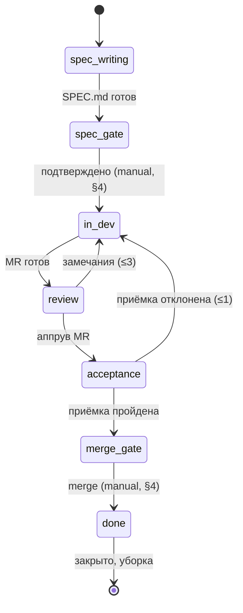
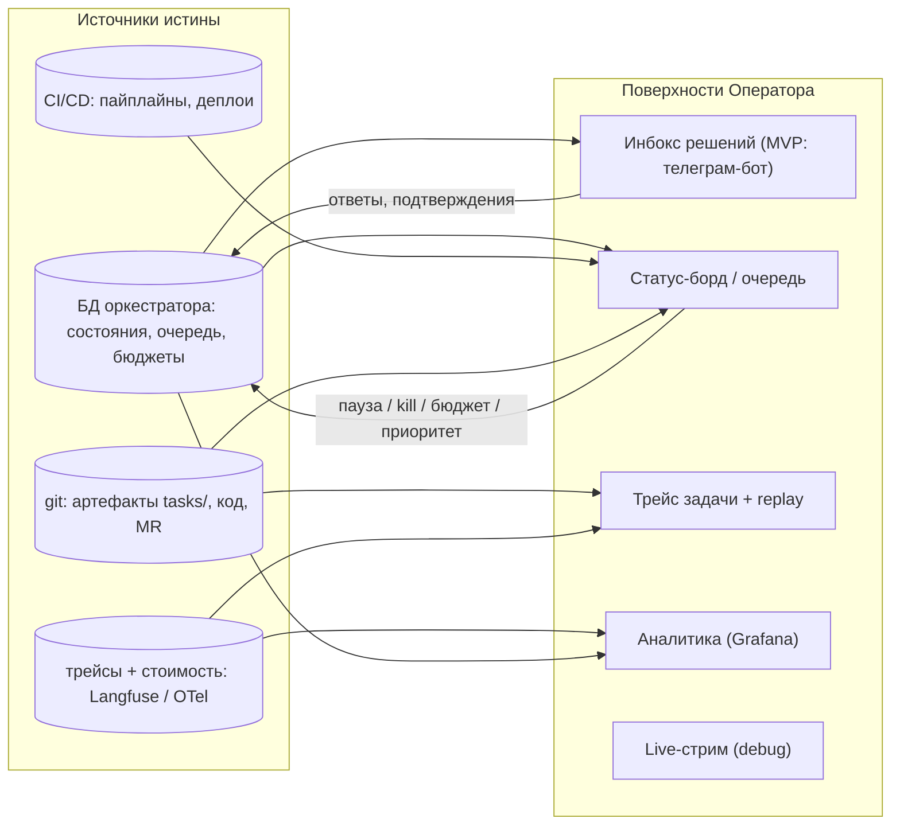

# Артель: агентская система «запрос оператора → прод»

Проект системы LLM-агентов, автономно доводящей запрос единственного человека
в контуре — Оператора — до работающего кода в проде. Спроектировано от свойств
агентов (контекст, потери на передачах, цена токенов), а не от аналогий
с человеческой командой.

> **Горизонт документа.** Миссия фаз A–C заканчивается **смердженным
> MR** (ADR-0003 п.9: пост-merge наблюдения нет). Прод-контур — деплой,
> дежурный, watching, инциденты — целевая картина за горизонтом,
> перенесена в `docs/deferred/prod-loop.md`; рынок (§15) —
> в `docs/audits/market-2026-08.md`; карта исполнителей (§16) —
> в `docs/deferred/executors.md`. Номера секций сохранены как якоря.

> **Четыре несущих принципа**
> 1. Агент — только там, где нужно суждение. Всё детерминированное (деплой,
>    гейты, маршрутизация состояний) — код и пайплайны, не LLM.
> 2. Роль оправдана только свежим контекстом, конфликтом интересов
>    (проверяющий ≠ автор) или отдельными правами. Иначе — слить.
> 3. Git — шина артефактов. Агенты общаются документами в репозитории,
>    а не историей чата.
> 4. **Принцип целостности.** Задача выполнена, только если система в целом
>    не стала хуже: ни один инвариант не нарушен, ни один существующий гейт,
>    тест или лимит не ослаблен, поведение вне зоны задачи не изменилось.
>    Локальное улучшение ценой системного ухудшения — дефект, а не результат.
>    Производные правила: (а) оценка влияния — артефакт, а не мысль
>    (секция «Влияние на систему» в PLAN); (б) ослабление защит — только
>    Оператором через ADR; (в) изменение обратимо, необратимое — всегда
>    ручной гейт; (г) неуверенность в безопасности изменения = эскалация,
>    не попытка. «Не навреди» как гарантия недоказуемо — принцип формулирует
>    проверяемые обязанности ролей: оценить, не ослабить, уметь откатить,
>    эскалировать сомнение.

---

## 1. Схема потока

Поток текущего горизонта: Оператор даёт ТЗ свободным текстом → роль
`analyst` пишет SPEC с критериями приёмки AC-n (roadmap A5) → гейт
SPEC (Оператор) → роль `test_author` пишет залоченные приёмочные
тесты до кода (roadmap A4) → разработчик: PLAN → ветка + код +
юнит-тесты → ревьювер (свежий контекст, только артефакты) → verify
(детерминированные проверки по профилю проекта, ADR-0003 п.10) →
гейты acceptance и merge (Оператор) → merge — конец маршрута.
Оркестратор — конечный автомат, не LLM; эскалации по лимитам —
Оператору. Состояния — §6.

Исходная схема «запрос → прод» (с верификатором на стенде, CI/CD-гейтом
деплоя и дежурным) — `docs/deferred/prod-loop.md`.

---

## 2. Роли

> **Superseded (частично) — см. ADR-0003, 2026-08-24.** Строки
> «Аналитик» и «Верификатор» устарели: аналитик — роль `analyst`
> внутри конвейера, вход — ТЗ Оператора свободным текстом (roadmap
> A5, решение 23.08); верификатор разделён — приёмочные тесты ДО кода
> пишет роль `test_author` (roadmap A4), имя `verifier` закреплено
> за пост-кодовой верификацией по verify-профилю проекта (ADR-0003
> пп.10–11). Прод-роли (Деплой, Дежурный) — за горизонтом: миссия
> текущего горизонта кончается смерженным MR; их строки перенесены
> в `docs/deferred/prod-loop.md`.

| Роль | Версия | Зачем выделена | Вход | Выход | Инструменты / права |
|---|---|---|---|---|---|
| **Оркестратор** | MVP | Единственный долгоживущий компонент. Конечный автомат состояний задачи; LLM-триаж входящих — вспомогательный классификатор, в ранних фазах не нужен (запрос оформляет Оператор). Никогда не исполняет работу сам — маршрутизирует, следит за лимитами, эскалирует. | события: артефакты ролей, вебхуки CI, алерты | назначения ролям, состояние задачи, эскалации | БД состояния, запуск агентов, каналы к Оператору, сервисный аккаунт мержа. **Не читает содержимое кода; единственное право записи в репо — merge MR, прошедшего guards + policy (§4).** *Фаза 0:* вход ревьювера собирает оркестратор — ревью-пакет (SPEC, PLAN, прошлый REVIEW, форма вердикта `templates/REVIEW.md`, стат-список и diff ветки) уходит в промпт шага одним куском, но не безразмерным: под потолками 4000 строк diff и 400 000 байт пакета, сверх которых содержимое усекается с явной пометкой об усечении; файлы сверх пакета ревьювер читает точечно, называя причину чтения в замечании. Размер пакета — в журнал (T011). Содержательных решений по коду оркестратор по-прежнему не принимает, а merge выполняет только `approve` из `merge_gate` (инвариант 12, T010). |
| **Аналитик** | MVP | Единственный интерфейс к Оператору. Превращает размытый запрос в проверяемые требования; в конце — приёмка результата против них же. | запрос Оператора; на приёмке — TEST_REPORT со стенда (**приёмка до деплоя**; после деплоя — только smoke пайплайна) | SPEC.md: контекст, требования, критерии приёмки, «не входит» | чтение репозитория (read-only), диалог с Оператором |
| **Разработчик** | MVP | Исполнитель. Планирование — его первая фаза (PLAN.md как артефакт внутри задачи); отдельный архитектор — только в полной версии для крупных задач. | SPEC.md, замечания ревью, отчёты тестов | PLAN.md, ветка, код, юнит-тесты, MR | песочница, запись в свою ветку, запуск локальных тестов. **Не может мержить и деплоить.** |
| **Ревьювер** | MVP | Свежий контекст: не наследует ни одной строки контекста разработчика — только артефакты. Конфликт интересов встроен: его метрика — найденные дефекты. Работает в две фазы: **гейт плана** (дешёвая проверка PLAN.md до кодинга — декомпозиция, пропущенные требования; практика Jules Planning Critic: −9.5% фейлов задач) и полное ревью MR. | SPEC.md, PLAN.md, diff MR | аппрув плана; REVIEW.md: замечания с severity или аппрув-токен | read-only по коду, право поставить аппрув-метку в MR. **Не может править код.** *Фаза 0:* обе фазы идут одним прогоном ревьювера — отдельного состояния `plan_review` в конечном автомате нет (§6), гейт плана выполняется как фаза A скила `review-checklist`; разделение — в MVP. |
| **Верификатор** | MVP | Проверяет систему против SPEC, не против кода. Пишет тесты до/параллельно разработке — независимая интерпретация требований. Верификация — только исполнением (прогон на стенде), никогда чтением кода: «поверхностная верификация» — причина отказов №1 у мультиагентных систем. Где критерии позволяют — property-based: из критерия извлекается свойство и обстреливается рандомизированными кейсами (подход Kiro) — защита от кода, проходящего тесты случайно. | SPEC.md; после аппрува — собранная ветка на стенде | приёмочные тесты (в репо), TEST_REPORT.md | стенд (деплой ветки через CI), запись только в каталог тестов |
| **Безопасник** | полная | В MVP — не роль, а гейт (SAST/зависимости в CI). Агент появляется, когда отчёты гейтов требуют суждения: триаж находок, false positives, задачи на фиксы через оркестратор. | отчёты SAST/SCA, diff MR | вердикт по находкам, задачи на фиксы | read-only код и отчёты |
| **Куратор знаний** | полная | Замыкает обучение системы: из закрытых задач, ревью и инцидентов обновляет конвенции и скилы. В MVP это делает разработчик по замечанию ревьювера. | закрытые задачи, REVIEW.md, постмортемы | обновления конвенций, ADR, скилов | запись в docs/ и skills/ через обычный MR |

Чего здесь **нет** и почему: БА и СА слиты в одного Аналитика (две
последовательные документо-генерирующие роли — испорченный телефон);
«декомпозитор ТЗ» — фаза планирования разработчика, а не роль; «девопс» —
это CI/CD, настроенный заранее, плюс дежурный для инцидентов пайплайна.

---

## 3. Артефакты и связи

| Артефакт | Автор → потребитель | Содержимое |
|---|---|---|
| `tasks/<id>/REQUEST.md` | Оператор → Аналитик | сырой запрос + переписка уточнений |
| `tasks/<id>/SPEC.md` | Аналитик → Разработчик, Верификатор, Ревьювер | контекст, требования, **проверяемые критерии приёмки**, явное «не входит» |
| `tasks/<id>/PLAN.md` | Разработчик → Ревьювер, Оркестратор | декомпозиция на независимо проверяемые единицы размера MR (не «минимальные операции») |
| ветка + MR | Разработчик → Ревьювер | код, юнит-тесты, описание изменений |
| `tasks/<id>/REVIEW.md` | Ревьювер → Разработчик, Оркестратор | замечания с severity и привязкой к строкам, либо аппрув |
| `tasks/<id>/TEST_REPORT.md` | Верификатор → Аналитик, Оркестратор | прогон приёмочных тестов на стенде, матрица «критерий → статус» |
| запись о деплое | пайплайн → Дежурный, Аналитик | версия, время, diff релиза, ссылка на smoke |
| `incidents/<id>.md` | Дежурный → Оркестратор | симптомы, триаж, связь с деплоем, решение об откате |

Каждая передача между ролями материальна: файл в репозитории задачи.
Это одновременно протокол общения, чекпоинт восстановления и трейс
для наблюдаемости — три задачи одним механизмом.

*Фаза 0 (ADR-0001):* `REQUEST.md` не заводится — запрос Оператор формулирует
сразу в SPEC.md **(superseded частично — roadmap A5, tasks/T025: с ТЗ,
сохранённым в `TZ.md`, SPEC пишет роль `analyst`, `roles.yaml`:
`executor: agent`; без `TZ.md` — прежний флоу этого абзаца, роль исполняет
Оператор)**. Шаблонов в `templates/` четыре: SPEC, PLAN, REVIEW,
TEST_REPORT; последний ждёт верификатора и в Фазе 0 не пишется. Записи
о деплое и `incidents/` нет — нет и контуров, которые их порождают.

---

## 4. Циклы обратной связи и эскалации

| Событие | Реакция | Лимит | После лимита |
|---|---|---|---|
| Гейт плана отклонил PLAN.md | Разработчик перепланирует с учётом замечаний | 2 итерации | эскалация Оператору (обычно сигнал плохого SPEC) |
| Ревью отклонило MR | Разработчик правит по REVIEW.md, новый прогон ревью | 3 итерации | эскалация Оператору с полным трейсом разногласия |
| Приёмочные тесты упали | Разработчик фиксит, повторный прогон (ревью — только если diff нетривиален) | 3 итерации | эскалация Оператору |
| Разработчику неясен SPEC | вопрос Аналитику, тот отвечает или идёт к Оператору | 1 раунд | Оператор |
| Верификатор и SPEC расходятся с кодом | вердикт Аналитика: чинить код или уточнять SPEC | 1 раунд | Оператор |
| Приёмка отклонила результат | вердикт Аналитика: доработка (возврат в разработку) или уточнение SPEC | 1 итерация | Оператор: деплоить как есть / доработать / закрыть |
| Деплой упал / smoke красный | автооткат пайплайном, задача разработчику | авто | Оператор уведомлён всегда |
| Инцидент в проде | Дежурный: триаж → откат (детерминир.) → INCIDENT.md → задача в очередь | SLA триажа | Оператор при любом откате |
| Превышен бюджет / таймаут задачи | пауза, состояние сохранено (артефакты в git) | жёсткий | Оператор решает: добавить бюджет / закрыть |

Правило: **ни одного незамкнутого цикла**. У каждой ошибки есть путь
обработки, у каждого пути — числовой лимит, после лимита — всегда Оператор,
никогда «ещё одна попытка». Оператора дёргают в трёх случаях: неоднозначность
требований, исчерпанный лимит, решение о проде.

**Все счётчики итераций — глобальные на задачу:** повторный вход в фазу
(фикс после упавших тестов → ре-ревью) не сбрасывает их — иначе попарное
зацикливание ревью↔тесты через разработчика легально. И честно о guards:
они проверяют *структуру* артефакта (frontmatter, обязательные секции —
простой скрипт); содержательность гарантируется ручным гейтом SPEC и свежим
контекстом потребителей, не guards.

**Реализовано в Фазе 0.** Лимиты цикла ревью (3) и приёмки (1) живут
в `config.LIMIT_REVIEW_ITERS` / `LIMIT_ACCEPT_REJECTS` и закодированы
инвариантами 3–4 (T010); глобальность счётчиков проверяется тестом
на возврат из эскалации — ни один переход их не сбрасывает (инвариант 4).
Отдельного цикла гейта плана нет (§2). Потолок задачи можно задать при
постановке: `budget_usd` во frontmatter SPEC применяется один раз,
на переходе `spec_writing → spec_gate`, и **только вниз** — значение выше
дефолтного отвергается с предупреждением, потому что поднять потолок вправе
лишь Оператор командой `budget` (T012, инвариант 10). Кто задал потолок,
помнит колонка `budget_source`: ручное значение сильнее значения из SPEC.

### Политика гейтов: авто / ручное подтверждение на каждом переходе

Третий столп управления рядом с лимитами и эскалациями. Это не глобальный
«режим системы» (грубый инструмент: в ручном Оператор тонет в подтверждениях,
в авто теряет контроль везде сразу), а **политика на каждом переходе FSM**.
Гейты — плановые остановки, эскалации — исключения; они не смешиваются:
эскалация всегда ручная по природе.

Каждый переход имеет два независимых слоя:

- **Guards — автоматические условия, неотключаемые.** CI зелёный, артефакт
  валиден по шаблону, лимиты не исчерпаны. Это физика системы: даже в полном
  авто нельзя смержить с красным CI.
- **Policy — кто даёт разрешение:** `auto` (guards прошли → переход),
  `manual` (карточка в инбокс Оператора → ждём), `conditional` (авто при
  выполнении предикатов, иначе ручное).

> **Два жёстких правила.**
> 1. Молчание ≠ согласие: ручной гейт по таймауту не «автопроходит» — задача
>    висит в `awaiting-approval`, жжёт ноль токенов; по таймауту только
>    напоминание.
> 2. Policy проверяет оркестратор, не агент: агент не знает режима гейта —
>    он всегда просто отдаёт артефакт. Иначе появляется вектор «агент решил,
>    что можно» — источник канонических инцидентов рынка.

| Переход | Дефолт MVP | Почему | Куда может уехать |
|---|---|---|---|
| Запрос → SPEC принят в работу | **manual** | самый дешёвый гейт: 2 минуты чтения SPEC экономят бюджет задачи «не про то» | conditional (авто для багфиксов) |
| SPEC → разработка | auto | SPEC подтверждён — незачем подтверждать старт | — |
| Гейт плана (ревьювер) | auto | агентский гейт, Оператора тут нет | — |
| Ревью MR → merge | **manual** первое время | реальный merge rate агентных PR 43–83% — доверие зарабатывается | **conditional** — главный кандидат |
| Merge → deploy prod | **manual** | решение о проде — Оператора (§12) | авто со стоп-краном по счётчику доверия |
| Откат при инциденте | **auto** | асимметрия направлений: движение в безопасную сторону не ждёт человека — ждать при пожаре вреднее | — |
| Увеличение бюджета / лимитов | **manual всегда** | тот случай, ради которого лимиты существуют | никогда |

Асимметрия по строкам — принцип: **откат — авто, выкат — вручную**.
Подтверждение нужно там, где действие необратимо или направлено наружу;
обратимые движения в безопасную сторону автономны всегда.

**Conditional — рабочая точка.** Политика как код, в git, ревьюится как код:

```yaml
# gates.yaml
merge:
  mode: conditional
  auto_if:
    - diff_lines < 200
    - no_migrations
    - no_paths: ["**/auth/**", "ci/", "**/payments/**",
                 "gates.yaml", "roles.yaml", ".gitlab-ci.yml",
                 "templates/", "skills/"]  # конфиги системы — всегда вручную
    - review_major_findings == 0
    - acceptance_tests_first_pass
  else: manual
```

Рутинный багфикс проезжает сам; всё, что трогает миграции, auth или прошло
ревью со скрипом, приходит карточкой Оператору. Каждое авто-прохождение
логируется вместе с доказательствами предикатов — аудит «почему это уехало
без меня» = один запрос. (Это autonomy slider Factory.ai, воспроизведённый
прозрачно.)

**Защита политики от самой системы:** policy-движок читает `gates.yaml`
только из main — версия из ветки MR игнорируется; конфиги системы
(gates.yaml, roles.yaml, CI, шаблоны, скилы) всегда в no_paths. Иначе
агент-разработчик может ослабить политику мержа собственным MR, и при
conditional с diff < 200 строк такой MR сам себе откроет auto-merge.

*Фаза 0:* policy-движка нет. `gates.yaml` заведён с первого дня, но
справочный — все гейты (`spec_gate`, `acceptance`, `merge_gate`)
захардкожены ручными и проходятся только `approve`/`reject` Оператора;
сколько ни опрашивай `advance`, гейт стоит (ADR-0001, инварианты 6–7).
Команда `auto` (T014) снимает с Оператора механическое чередование шагов,
но не решения: `approve`/`reject` она не вызывает и пути мимо гейта
не имеет (инвариант 18). Конфиги системы прикрыты не policy, а job'ом
`protected-paths` в CI — в Фазе 0 это предупреждение, после разделения
токенов станет fail (T010, ADR-0001).

**Эволюция доверия — данными.** Оркестратор ведёт по каждому гейту счётчик
«подтверждено без изменений подряд»; по порогу система сама предлагает
перевести гейт в auto или ослабить предикаты — карточкой в тот же инбокс.
Решает человек, подсказывает статистика. Обратный ход автоматический:
отклонённый merge сбрасывает счётчик, инцидент откатывает гейт в manual.

**Три уровня переопределения:** глобальный дефолт (`gates.yaml`) → на задачу
(Оператор при постановке: «рискованное — всё вручную» / «косметика — всё
авто», кроме гейтов «никогда») → **panic mode**: одна команда переводит все
гейты всех задач в manual, не убивая работу.

**Антипаттерн — усталость от подтверждений.** Много ручных гейтов → Оператор
штампует «ок» не глядя — хуже честного авто, потому что создаёт иллюзию
контроля (alarm fatigue). Противоядия: мало осмысленных гейтов; карточка
несёт выжимку (diff-статистика, находки ревью, отчёт тестов), а не голое
«подтверди»; метрика «медианное время на подтверждение» — упала до секунд →
гейт пора в conditional либо карточка плохая.

---

## 5. Скилы ролей

Конфигурация роли = **короткий системный промпт** (личность, цель, границы —
«кто ты и чего не делаешь») + **набор скилов** (процедурные знания,
подгружаемые модули) + **права**. Ни один процедурный текст не живёт в двух
промптах — повторяющееся вынесено в общий скил и правится в одном месте.

### Матрица «роль × скил»

Роли: АН — аналитик, РЗ — разработчик, РВ — ревьювер, ВФ — верификатор,
ДЖ — дежурный, БЗ — безопасник, КЗ — куратор. `●` — роль MVP,
`(●)` — роль полной версии.

| Скил | Слой | АН | РЗ | РВ | ВФ | ДЖ | БЗ | КЗ |
|---|---|---|---|---|---|---|---|---|
| `conventions-core` | базовый | ● | ● | ● | ● | (●) | (●) | (●) |
| `escalation-rules` | базовый | ● | ● | ● | ● | (●) | (●) | (●) |
| `memory-access` | базовый | ● | ● | ● | ● | (●) | (●) | (●) |
| `codebase-map` | общий | ● | ● | ● | ● | — | (●) | — |
| `git-workflow` | общий | — | ● | ● | ● | — | — | (●) |
| `ci-pipeline` | общий | — | ● | — | ● | (●) | — | — |
| `stand-management` | общий | — | — | — | ● | (●) | — | — |
| `spec-writing` | ролевой | ● | — | — | — | — | — | — |
| `acceptance-criteria` | общий | ● | — | — | ● | — | — | — |
| `coding-standards` | ролевой | — | ● | ● | — | — | — | — |
| `testing-strategy` | общий | — | ● | — | ● | — | — | — |
| `review-checklist` | ролевой | — | — | ● | — | — | — | — |
| `security-checklist` | общий | — | — | ● | — | — | (●) | — |
| `deploy-runbook` | ролевой | — | — | — | — | (●) | — | — |
| `incident-triage` | ролевой | — | — | — | — | (●) | — | — |
| `knowledge-curation` | ролевой | — | — | — | — | — | — | (●) |

### Реестр скилов

| Скил | Назначение | Содержимое | Активация |
|---|---|---|---|
| `conventions-core` | единый язык системы | форматы всех артефактов (шаблоны SPEC/PLAN/REVIEW/…), структура `tasks/`, стиль коммуникации | всегда в контексте |
| `escalation-rules` | когда остановиться | лимиты итераций, что считается тупиком, как оформить эскалацию Оператору | всегда в контексте |
| `memory-access` | работа с общей памятью | где лежат конвенции/ADR/постмортемы, как искать прецеденты прошлых задач | по триггеру |
| `codebase-map` | ориентация в проекте | карта модулей, точки входа, где что искать; генерируется и обновляется автоматически | по триггеру |
| `git-workflow` | единый флоу веток | именование веток, формат коммитов/MR, rebase-политика, работа с worktree | по триггеру |
| `ci-pipeline` | что гоняет CI | стадии пайплайна, как читать падения, как запустить прогон/деплой ветки на стенд | по триггеру |
| `stand-management` | стенды | какие стенды есть, как занять/освободить, наполнение тестовыми данными | по триггеру |
| `spec-writing` | качество требований | шаблон SPEC, чек-лист полноты, техника вопросов Оператору, обязательное «не входит» | всегда (у Аналитика) |
| `acceptance-criteria` | проверяемость | как писать критерии, по которым можно написать тест; примеры хороших/плохих; извлечение свойств для property-based тестов | всегда (у обоих) |
| `coding-standards` | единый стиль кода | стайлгайд, паттерны проекта, эталонные классы, антипаттерны из прошлых ревью | всегда (у Разработчика) |
| `testing-strategy` | пирамида тестов | что покрывать юнитами vs приёмочными, фикстуры, как гонять локально | по триггеру |
| `review-checklist` | полнота ревью | два чек-листа: гейт плана (декомпозиция, покрытие требований SPEC) и ревью MR (соответствие SPEC, корректность, простота, тесты); формат замечаний с severity | всегда (у Ревьювера) |
| `security-checklist` | безопасность в ревью | OWASP-минимум для стека проекта, работа с секретами, чтение SAST-отчётов | по триггеру |
| `deploy-runbook` | процедура выката/отката | что смотреть в окно после деплоя, критерии отката, как дёрнуть откат | всегда (у Дежурного) |
| `incident-triage` | разбор инцидентов | дерево триажа: симптом → куда смотреть; шаблон INCIDENT.md; связь алертов с деплоями | по алерту |
| `knowledge-curation` | обучение системы | как из закрытой задачи извлечь урок: обновить конвенцию, скил, добавить антипаттерн | по расписанию |

Критерий достаточности набора: роль закрывает свою зону ответственности и все
свои ветки ошибок, не запрашивая знаний у других ролей. Скилы «всегда
в контексте» — короткие (жгут токены каждый запуск); тяжёлое содержимое —
только по триггеру.

---

## 6. Runtime: как агенты живут

**Модель запуска.** Эфемерные агенты на шаг — модель CI-джобы: контейнер
поднялся, получил артефакты, отработал, закоммитил результат, умер. Дёшево,
воспроизводимо, нечему течь. Единственный долгоживущий компонент —
оркестратор (лёгкий сервис: БД состояния + подписка на события). Дежурный —
тоже эфемерный: запуск по алерту и по расписанию.

**Триггеры.** Запрос Оператора (чат/CLI) → оркестратор. Вебхуки CI (пайплайн
зелёный/красный, MR обновлён) → оркестратор. Алерты мониторинга → дежурный.
Расписание → дежурный (обход) и куратор знаний. Каждый триггер порождает шаг
конечного автомата, а не «будит» агента в вечном цикле. Вебхуки — основной
канал, поллинг статусов CI — фоллбек: потерянная доставка вебхука не должна
вешать задачу до суточного алерта.

> **Superseded — см. ADR-0003 п.9, 2026-08-24.** «Вебхуки — основной
> канал» отменено: **поллинг — основной** (вебхуки корп-GitLab
> на хост Оператора не обещаем — входящей связности нет), вебхук —
> опция; поллер — прерываемый level-based процесс во всех эпохах,
> несущий инвариант — «догон без потерь» (Р5, C0).

*Фаза 0 фактически.* Оркестратор — не сервис, а CLI
(`orchestrator/artel.py`): шаг порождает только команда Оператора. Событий
CI конечный автомат не получает вовсе — ни вебхуком, ни поллингом; этот
канал появится вместе с оркестратором-сервисом, а пока красный CI видит
Оператор на ручном гейте. Предшественник демона уже есть: `auto <id>`
сам чередует `run` и `advance`, пока задача в агентском состоянии
(`in_dev`, `review`), и останавливается на первом месте, где нужен
человек, — ручной гейт, эскалация, `done`/`killed`, отказ `run` по бюджету
или потолок `AUTO_MAX_STEPS` шагов за вызов (T014). Разница с демоном одна
и намеренная: цикл запускает Оператор, и решений цикл не принимает.

**Очередь и параллелизм.** Очередь задач — таблица в БД оркестратора.
MVP: задачи строго последовательно (одна активная), внутри задачи роли —
по конвейеру. Полная версия: N параллельных задач, изоляция через
ветки/worktree; конфликт за файлы решается на уровне планирования
(оркестратор не пускает в работу задачи с пересекающимися зонами).

**Устойчивость.** Каждый шаг идемпотентен: результат — артефакт в git,
коммит атомарен. Упал агент посреди шага — шаг перезапускается с чистого
контейнера от последнего артефакта; ничего «в памяти» не живёт. Чекпоинт =
последний закоммиченный артефакт. Два уровня отказов обрабатываются
по-разному: **транзиентные** (rate limit, таймаут API, обрыв сети) — ретраи
с экспоненциальным бэкоффом внутри шага, не считаются итерацией;
**содержательные** — циклы §4. Оркестратор ведёт журнал шагов в БД (шаг,
статус, попытки, стоимость) — транзиентные ошибки без журналирования —
главный источник развала таких систем в проде (Codex, Replit Agent и агенты
Cursor не зря работают на Temporal).

**Завершение и уборка.** Задачу закрывает оркестратор после приёмки
Аналитиком. Уборка автоматическая: ветка смержена и удалена, стенд
освобождён, песочницы уничтожены, артефакты остаются в `tasks/<id>/`
как история.

**Потолки.** Таймаут шага (например 30 мин), таймаут задачи (часы, не дни),
бюджет токенов/денег на задачу, лимиты итераций циклов (§4). Всё — жёсткие:
по достижении пауза и эскалация, не деградация. Kill switch Оператора:
остановить шаг / задачу / всю систему одной командой. Отдельные состояния
`awaiting-approval` (ручной гейт §4) и `awaiting-human` (шаг у
человека-исполнителя §16): задача стоит с нулевой стоимостью сколько угодно,
таймаут задачи на них не распространяется — по таймауту только напоминание,
никогда автопроход.

*Фаза 0:* таймаут шага — 1800 с (`config.AGENT_TIMEOUT_SEC`); ненулевой код
возврата агента — провал шага, который ретраится с бэкоффом и итерацией
ревью не считается, а после исчерпания попыток эскалирует в тот шаг, где
упал (T006, инвариант 5). Бюджет задачи — жёсткий: на 70% предупреждение,
на 100% отказ запускать агента, пока Оператор не поднимет потолок
(T007, инварианты 8–9). Kill switch есть и убирает хвосты задачи — каталог
и несмерженную ветку, — не трогая main и логи прогонов (T008,
инварианты 14–16). Таймаута задачи и состояний `awaiting-*` нет: у FSM
Фазы 0 нет часов и фонового процесса, автопроходить нечему.

### Единый конечный автомат задачи



Источник истины по состояниям и переходам — код `orchestrator/fsm.py`;
диаграмма — его проекция. Оверлеи, доступные из любого состояния:
`escalated` (исчерпан лимит — ждёт решения Оператора) и `killed`.
Каждый переход = guards + policy (§4); лимиты на рёбрах — глобальные
счётчики задачи. Расширения маршрута в бою: `tests_writing` между
spec_gate и in_dev (A4, T023), `verifying` между review и acceptance
(ожидание CI — B1b/T079, ADR-0009; verify-профиль ADR-0003 п.10 —
дальше). Запланировано: `awaiting_human` после merge_gate ≡ undraft
для merge_gate: target-human (ADR-0003 п.7, фаза C). Целевой автомат
с прод-хвостом (deploy_gate → deployed → watching) —
`docs/deferred/prod-loop.md`.

Отдельного состояния гейта плана нет: `plan_review` слит с `review`
(§2), гейт плана — фаза A скила `review-checklist`; автогейт плана —
задача P3 роадмапа. Переход `review → acceptance` требует нового
REVIEW.md: вердикт ревьювера учитывается ровно один раз (T004,
инвариант 13).

---

## 7. Наблюдаемость самих агентов

Не путать с мониторингом прода (это вотчина дежурного). Здесь — прозрачность
самой системы для одного человека, который ею управляет.

| Что измеряем | Зачем | Где смотрим | Алерт |
|---|---|---|---|
| **North Star: доля задач, дошедших до прода без правок человека** | единственная честная мера автономности — бенчмарки систематически врут (merge rate реальных агентных PR у лидеров рынка 43–83% при 70%+ на SWE-bench) | дашборд, помесячно | падение тренда |
| Трейс задачи: цепочка запусков, решения, артефакты, итерации | разбор «почему система сделала так» | трейс-вьювер (Langfuse/OTel) + сами артефакты в git. **Фаза 0:** журнал шагов в БД (`artel.py log <id>`) с полем `actor` — исполнителем шага — и артефакты в git; трейс-вьювера нет (T010, инвариант 11) | — |
| Стоимость задачи (токены, $) | экономика, обнаружение разгона | дашборд, разбивка по ролям. **Фаза 0:** стоимость и токены каждого шага снимаются с финального события потока, копятся в `spent_usd` и попадают в журнал (T007) | задача превысила 70% бюджета — **реализовано** (T007) |
| Время прохождения запрос→прод | здоровье конвейера | дашборд | нет нового артефакта > X часов («застряла») |
| Доля задач с эскалацией | качество SPEC и лимитов | дашборд, еженедельно | рост тренда |
| Доля отклонённых ревью / итераций на MR | качество разработчика и скилов | дашборд | стабильно у потолка лимита → скилы деградировали |
| Прохождение приёмочных тестов с первого раза | качество связки SPEC ↔ реализация | дашборд | — |
| Молчащий агент | зависание запуска | — | шаг жив, но нет вывода > N мин → kill + перезапуск (не более 2 — системная причина вроде истёкшего токена ретраями не лечится), дальше эскалация |
| **Heartbeat оркестратора** | мёртвый оркестратор производит пустой инбокс, неотличимый от «всё хорошо» | внешний мониторинг (Grafana). **Фаза 0:** не применимо — оркестратор не демон, а CLI (ADR-0001), умирать между командами нечему (§6) | нет heartbeat > 5 мин |

**Пульт Оператора:** список задач с состояниями конечного автомата,
по клику — трейс и артефакты; кнопки пауза / возобновить / убить / добавить
бюджет / **откатить задачу к шагу N** (перемотка по git-чекпоинтам без
пересжигания бюджета — идея checkpoints из Kiro). В MVP это может быть CLI +
страница со статусами; полная версия — веб-дашборд.

**Определение «правки» для North Star:** изменение артефакта или кода
человеком после сдачи роли; аппрув на ручном гейте правкой не считается.
Исполнитель каждого шага пишется в журнал с первого дня (одно поле) — иначе
метрика несобираема ровно в период калибровки доверия, когда нужнее всего.

**Реализовано в Фазе 0** сверх отмеченного в строках таблицы: лог прогона
пишется в `.artel/logs/` и одновременно стримится в терминал по ходу шага
(T005), а `kill` его не трогает — история наблюдаемости переживает задачу
(T008, инвариант 16); размер ревью-пакета уходит в журнал до первой попытки,
и по нему видно, чем задана стоимость прогона (T011). Журнал пишется всегда:
запуск, исход, стоимость, сбой лога, уборка (инвариант 11). Дашбордов,
Langfuse и внешнего мониторинга нет — вся наблюдаемость Фазы 0 это журнал
шагов в БД и файлы логов.

---

## 8. Настроить до запуска

- **Репозиторий:** защита main — мерж только при зелёном CI + аппрув-метке
  ревьювера; шаблоны артефактов в `templates/`; структура `tasks/`,
  `docs/adr/`, `skills/`.
- **Политика гейтов:** `gates.yaml` в репо + проверка policy в оркестраторе;
  авто-мерж выполняет только сервисный аккаунт оркестратора после
  policy-check — branch protection остаётся второй, физической линией защиты.
- **Идентичности ролей:** отдельный токен/аккаунт на каждую роль
  с минимальными правами — без этого разделение прав §2 существует только
  в промптах. Там, где аппрувы не блокируют мерж нативно (GitLab Free,
  GitHub Free private): enforcement = CI-джоба, проверяющая *автора*
  аппрув-метки (именно аккаунт ревьювера), + protected main, куда мержит
  только сервисный аккаунт оркестратора.
- **CI:** линт, юнит-тесты, SAST + проверка зависимостей, сборка — на каждый
  MR. Красный CI = разработчик не может передать MR ревьюверу.
- **Стенд:** автодеплой ветки по запросу верификатора, тестовые данные,
  сброс в исходное состояние.
- **Прод-пайплайн:** сборка → миграции → выкатка → smoke → автооткат при
  красном smoke. Прод-креды — только внутри пайплайна, агентам не выдаются
  никогда.
- **Песочницы:** контейнер-образ агента (инструменты, доступ к репо,
  без сети наружу кроме API моделей и белого списка).
- **Секреты:** vault; агенту в контейнер попадает только его минимальный
  набор.
- **Оркестратор:** БД состояния, приём вебхуков, счётчик бюджета,
  kill switch.
- **Наблюдаемость:** экспорт трейсов и стоимости с первого дня — доустроить
  дашборд потом можно, а восстановить историю нельзя.

*Что настроено в Фазе 0 фактически.* CI (GitHub Actions) гоняет три job'а:
`guard.py` по всем артефактам задач, компиляцию и юнит-тесты оркестратора,
`protected-paths` — предупреждение на PR, трогающий конфиги системы, реестр
инвариантов и его тест (T010). Осознанно не настроено (ADR-0001): branch
protection недоступен на приватном репозитории Free-плана, токен один
на все роли — слоты в `roles.yaml` раздельные с первого дня, поэтому
разделение PAT не потребует правок кода и обязательно при выходе из Фазы 0.
Стенда, прод-пайплайна, vault и экспорта трейсов нет; образ песочницы
заведён (`sandbox/Dockerfile`), но в конвейере пока не используется —
агент запускается на машине Оператора с белым списком инструментов.

---

## 9. Память и знания

| Что помним | Где лежит | Кто обновляет |
|---|---|---|
| Конвенции, стайлгайд, антипаттерны | `docs/conventions/` + скил `coding-standards` | MVP: разработчик по замечанию ревью; полная: куратор |
| Архитектурные решения | `docs/adr/` | разработчик при значимом выборе в PLAN |
| История задач с артефактами | `tasks/<id>/` | появляется само по ходу работы |
| Карта кодовой базы | скил `codebase-map` | генератор-скрипт в CI после мержей в main; провал регенерации — алерт, не молчание (устаревшая карта = уверенно неверная навигация агентов, проявится ростом итераций без видимой причины) |
| Постмортемы | `incidents/` | дежурный |
| **Инварианты системы**: что не должно сломаться ни в одной фазе, каким тестом ловится, откуда взято | `docs/invariants.md` + `tests/test_invariants.py` | разработчик — добавляя защиту; ослабить может только Оператор через ADR (T010, ADR-0002) |

Вида памяти «реестр инвариантов» в исходном проекте не было — он появился
из принципа целостности: закрытие риска, живущее только текстом, ничем
не отличается от невыполненного (§13).

*Фаза 0:* `docs/adr/` и `tasks/` работают как описано. Конвенции живут
в `skills/` и `CLAUDE.md`; каталоги `docs/conventions/` и `incidents/`
не заводились, а рукописный `codebase-map` остался в плане Фазы 0
несделанным (§12).

Вся память — файлы в git: версионируется, ревьюится тем же конвейером,
доступна любой роли через скил `memory-access`. Отдельная векторная БД в MVP
не нужна — grep по структурированным документам достаточен; добавлять
по триггеру «поиск прецедентов стал узким местом».

---

## 10. Экономика

Основные статьи расхода: **итерации разработчика** (самые длинные контексты,
много инструментальных вызовов) и **контекст ревьювера** (читает diff + SPEC
+ кодовую базу). Схема ограничивает их так:

- Эфемерные роли получают минимальный контекст: свои артефакты + скилы
  по триггеру, а не историю всей задачи.
- Лимиты итераций (§4) ограничивают *структуру* худшего случая, но не
  стоимость: внутри шага расход не ограничен ничем, кроме бюджета. Честно:
  потолок задачи = её денежный бюджет; лимиты лишь не дают худшему случаю
  быть бесконечным.
- Бюджет на задачу — жёсткий, с алертом на 70%. *Реализовано в Фазе 0
  (T007);* класс задачи виден при постановке — `budget_usd` из SPEC
  понижает потолок, поднять его вправе только Оператор (T012,
  инвариант 10). Дефолт правился решениями Оператора по факту прогонов:
  $5 → $10 → $50 — многоитерационные циклы ревью не влезали в исходную
  оценку.
- Разные модели по ролям: сильная — разработчику и ревьюверу, средняя —
  аналитику и верификатору, дешёвая — триажу оркестратора и суммаризациям.
- Кэширование промптов работает *внутри шага* (многоходовый цикл агента —
  и есть основной расход); между эфемерными шагами, разделёнными CI
  и ожиданиями, кэш чаще холодный из-за TTL — межшаговую экономию в расчёты
  не закладывать.
- **Не параллелить исполнителей внутри задачи.** Данные Anthropic по их
  мультиагентной системе: мультиагентность ≈ 15x токенов и плохо подходит
  для тесно связанного кодинга — агенты дублируют работу и оставляют дыры
  на стыках. Последовательный конвейер ролей — не компромисс, а оптимум;
  параллелизм — только между независимыми задачами.

---

## 11. Анализ стека

| Критерий | A: Claude Agent SDK + тонкий оркестратор | B: LangGraph + Langfuse | C: Temporal + агенты поверх API |
|---|---|---|---|
| Скорость MVP | ●●● агент-кодер, скилы (SKILL.md), песочницы, MCP — из коробки; писать только конечный автомат оркестратора | ●●○ граф быстро, но инструменты кодинга (git, exec, редактирование) собирать самому | ●○○ максимум кода до первого результата |
| Контроль циклов и лимитов | ●●○ в самописном оркестраторе — полный; внутри шага агент автономен (лечится таймаутом и бюджетом на шаг) | ●●● граф с явными рёбрами, чекпоинты, прерывания — сильная сторона | ●●● индустриальная durability, ретраи, версионирование workflow |
| Наблюдаемость | ●●○ хуки + OTel-экспорт, стоимость видна; трейс-вьювер добавить (Langfuse) | ●●● LangSmith/Langfuse нативно | ●●○ workflow-история отличная, LLM-специфику строить самому |
| Vendor lock-in | привязка к Anthropic; смягчение — артефакты в git и состояние в своей БД, мигрируемо | model-agnostic | model-agnostic |
| Стоимость эксплуатации | низкая: сервис + CI | средняя: свой рантайм графа + тулинг | высокая: кластер Temporal + воркеры |
| Порог для одного мейнтейнера | ●●● низкий | ●●○ средний | ●○○ высокий |

> **Рекомендация: вариант A для MVP.** Домен — кодинг, и готовый агент-кодер
> с нативными скилами закрывает самую дорогую часть работы; масштаб — один
> мейнтейнер. Изоляция — контейнеры (образ агента + CI-раннеры), шина
> артефактов — git, состояние — SQLite/Postgres у оркестратора, трейсы —
> Langfuse или OTel с первого дня.
>
> **Триггеры пересмотра:** нужен сложный параллелизм или workflow длиннее
> суток с гарантиями → C (Temporal как оркестратор, агенты остаются);
> требование мультивендорности моделей или тонкого управления графом → B.
> Благодаря «артефакты в git + состояние в БД» миграция меняет оркестратор,
> а не систему.
>
> **Прослойка над агентным рантаймом — обязательна.** Горизонт жизни
> вендорских агентных продуктов ~год: за 2025–2026 умерли или поглощены
> Copilot Workspace, Amazon Q Developer, Gemini CLI, Codegen, Sweep-бот.
> Интерфейс «роль: вход-артефакты → выход-артефакты» — свой; чем роль
> исполняется (Agent SDK, CLI-агент, голый API) — деталь за прослойкой,
> заменяемая без перестройки системы.
>
> Отдельно: CrewAI/AutoGen-класс отвергнут осознанно — быстрые демо,
> но слабый контроль циклов и лимитов, а именно они здесь несущие.

**Стек Фазы 0 фактически.** Вариант A в урезанном виде: рантайм агента —
`claude` CLI в headless-режиме с белым списком инструментов на запуск;
оркестратор — python stdlib без единой внешней зависимости; состояние —
SQLite; шина артефактов — git; гейты и валидация — GitHub Actions.
Трейс-вьювера и OTel-экспорта нет: наблюдаемость собрана из журнала шагов
и логов прогонов (§7) — то есть рекомендация «трейсы с первого дня»
выполнена в дешёвом виде, а не отменена. Прослойка «роль = артефакты
in/out» соблюдена буквально: вызов рантайма агента изолирован в одном
модуле, смена рантайма не задевает конечный автомат.

Сам оркестратор из одного файла вырос в модульный пакет `orchestrator/` —
порядка сорока модулей плюс `artel.py`, где остались только разбор argv
и таблица команд (T015); несущие: `config` (пути и константы), `store` (БД, миграции, журнал),
`artifacts` (frontmatter и свежесть вердикта), `gitcmd`, `agent_log`,
`spend` (стоимость шага), `review` (ревью-пакет), `budget`, `fsm`,
`runner`, `auto`, `cleanup`, `catalog`.

---

## 12. Фаза 0 → MVP → полная версия

### Фаза 0 — MVP-минус: первый замкнутый цикл за 2–3 недели

Итог адверсариального ревью: MVP ниже — это месяцы обвязки, а система,
не породившая ни одной задачи, умирает недостроенной. Перед MVP —
минимальный срез:

- Роли-агенты только две: разработчик и ревьювер. SPEC.md пишет сам Оператор
  по шаблону; приёмку по критериям SPEC делает Оператор перед мержем
  (верификатор и стенд отложены).
- Оркестратор = CLI-скрипт: FSM в SQLite, поллинг CI вместо вебхуков;
  все гейты ручные и захардкожены — без gates.yaml и policy-движка.
- Телеграм — только уведомления; подтверждения из CLI.
- Скилы: `conventions-core`, `escalation-rules`, `coding-standards`,
  `review-checklist`; codebase-map — статичный рукописный файл.
- **Не режется даже здесь:** отдельные токены на роль (§8), лимиты
  (итерации, бюджет, таймауты), журнал шагов с полями
  шаг/роль/исполнитель/попытки/токены/$.
- **Критерий выхода:** 5 реальных задач прошли цикл «запрос → смерженный
  MR». Только после этого строятся верификатор со стендом, бот с кнопками
  и policy-движок.

> **Статус: Фаза 0 выполнена.** Критерий выхода достигнут 20.08.2026 —
> пятой задачей, прошедшей цикл «запрос → смерженный MR», стала T006.
> Всего на дату актуализации документа смержено 12 задач: T001, T003–T008,
> T010–T012, T014, T015.

**Реализовано сверх плана Фазы 0** — механизмы, которых в списке выше
не было, но без которых цикл не держался:

| Что | Задача |
|---|---|
| Учёт стоимости и токенов шага, жёсткий потолок бюджета с алертом на 70% | T007 |
| Реестр инвариантов `docs/invariants.md` + кодирующие их тесты, job `protected-paths` в CI | T010 |
| Ревью-пакет: вход ревьювера собирает оркестратор, размер — в журнал | T011 |
| Потолок задачи из `budget_usd` SPEC — только вниз | T012 |
| Команда `auto` — цикл `run`+`advance` до ближайшего места, где нужен человек | T014 |
| Оркестратор разбит на модульный пакет `orchestrator/` (§11) | T015 |

Там же, но мельче: свежесть вердикта ревьювера после возврата в разработку
(T004), лог прогона со стримом в терминал (T005), ретраи упавшего шага
с бэкоффом и возврат из эскалации в упавший шаг (T006), уборка хвостов
задачи при `kill` (T008).

**Из плана Фазы 0 не сделано:** телеграм-уведомления (подтверждения и так
идут из CLI, отдельный канал не понадобился), рукописный `codebase-map`
(§9) и поллинг CI — событий CI конечный автомат не получает вовсе, красный
CI видит Оператор на ручном гейте (§6). Пункт «не режется даже здесь»
урезан в одной позиции: отдельные токены на роль заменены общим ключом,
слоты в `roles.yaml` при этом раздельные с первого дня (ADR-0001,
даунгрейд 1). **Условия пересмотра ADR-0001** — отдельные fine-grained PAT
по слотам ролей и решение по branch protection — наступили вместе
с достижением критерия выхода и ждут Оператора.

### MVP — цикл замыкается end-to-end

> **Superseded (частично) — см. ADR-0003, 2026-08-24.** Состав ролей
> устарел в части аналитика и верификатора (то же, что пометка к §2):
> аналитик = роль `analyst` конвейера по ТЗ свободным текстом
> (roadmap A5); вместо единого верификатора — `test_author` до кода
> (roadmap A4) + verify-профиль после кода (ADR-0003 пп.10–11).
> Дальнейший план фаз — в roadmap/ADR-0003/0004, не в этом разделе.

- Роли: оркестратор, аналитик, разработчик, ревьювер, верификатор.
- Деплой: CI-пайплайн, запуск — подтверждением Оператора.
- Runtime: эфемерные запуски, задачи последовательно, таймауты + бюджет +
  kill switch.
- Наблюдаемость: экспорт трейсов и стоимости, статус-страница/CLI.
- Скилы: базовый слой + `git-workflow`, `codebase-map`, `ci-pipeline`,
  `stand-management`, `testing-strategy` + ядро ролевых (`spec-writing`,
  `coding-standards`, `review-checklist`, `acceptance-criteria`) —
  без stand-management и testing-strategy верификатор в MVP не выполнит
  свою функцию.

**Осознанно принятые риски:** за продом смотрит Оператор (нет дежурного);
безопасность = SAST-гейт без триажа; нет параллелизма; знания обновляются
вручную.

### Полная версия — добавлять по триггеру, не «потом»

- **Параллелизм задач** — когда очередь стабильно копится (>3 задач
  в ожидании); вместе с ним обязателен **merge queue** — сериализация мержей
  с прогоном гейтов на актуальном main (главные грабли Gas Town — хаос
  merge-очередей).
- **Дежурный** — когда инцидент после деплоя заметили люди раньше системы.
- **Безопасник** — когда SAST-гейт шумит (частые false positives) или
  пропустил реальную находку.
- **Куратор знаний** — когда ревью повторно ловит одни и те же антипаттерны.
- **Архитектор-планировщик** — когда крупные задачи разваливаются на этапе
  PLAN (лимит итераций из-за плохой декомпозиции).
- **Эволюция гейтов в auto/conditional** (обобщение автодеплоя
  со стоп-краном) — гейт за гейтом, когда его счётчик доверия
  «N подтверждений подряд без правок» достигает порога; предлагает система,
  решает Оператор (§4).
- **Веб-дашборд, векторный поиск прецедентов** — по боли, соответственно
  росту.

---

## 13. Главные риски и чем закрыты

Таблица рисков контура «запрос → прод» перенесена
в `docs/deferred/prod-loop.md` (дистилляция 2026-08-24). Действующие
механизмы закрытия рисков текущего горизонта: лимиты, бюджеты
и таймауты (§4, §6, §10); независимое ревью и залоченные приёмочные
тесты (§2, roadmap A4); изоляция обвязки и песочница (ADR-0003
пп.13–14); hash-фиксация и approve-по-sha (ADR-0003 пп.15, 17);
реестр инвариантов `docs/invariants.md` с кодирующими тестами.

*Фаза 0:* колонка «чем закрыт» перестала быть только текстом. Восемнадцать
инвариантов кодированы тестами и гоняются в CI на каждый push, а ослабить
защиту — тест, гейт, лимит, guard — вправе только Оператор отдельным ADR:
для роли конвейера такая правка не задача, а blocker в ревью (T010,
ADR-0002). Инварианты, которые тестом не выражаются, перечислены
в `docs/invariants.md` второй таблицей с честной причиной — не «забыли»,
а «проверяет ревьювер».

---

## 14. Визуальный контур Оператора

> **Superseded (частично) — см. ADR-0004 п.7, 2026-08-24.**
> Телеграм-бот как инбокс решений (главная поверхность MVP ниже,
> «Мессенджер как канал MVP», таблица «строить или взять») понижен
> до нотификатора со ссылками — или отменяется. Носитель этапа 1 —
> `artel report` (статический HTML из state.db), этап 2 — панель
> `panel/` с кнопками гейтов (approve-по-хэшу); разрез и этапы —
> ADR-0004 пп.1, 7.

Наблюдаемость (§7) отвечает «что измерять»; этот раздел — «через что один
человек этим управляет». Поверхности выводятся из вопросов, которые Оператор
реально задаёт системе, а не из привычных человеческих инструментов.

> **Несущее правило контура:** источник истины — БД оркестратора + git.
> Любой визуальный инструмент — read-only проекция. Единственный ввод через
> UI — явные контролы: пауза, kill, бюджет, приоритет, ответ на эскалацию.
> Антипаттерн — сделать трекер местом координации агентов: появляется
> двусторонний синк, источник истины расползается.

### Пять поверхностей

| Вопрос Оператора | Поверхность | Суть |
|---|---|---|
| **«Где я нужен?»** | Инбокс решений — **главная поверхность** | Очередь карточек-решений по трём поводам эскалации (§4): неоднозначность, исчерпанный лимит, подтверждение деплоя. Карточка = контекст-пакет (что случилось, трейс разногласия, варианты) + кнопки действия. Пуст инбокс — система работает (достоверно только вместе с живым heartbeat оркестратора, §7: мёртвый оркестратор тоже производит пустой инбокс). Инверсия трекера: не человек ходит к задачам, а решения приходят к человеку. |
| **«Что сейчас происходит?»** | Статус-борд | Канбан, где колонки — состояния конечного автомата (§6), а не человеческие статусы. Read-only проекция БД оркестратора; в полной версии — live-подсветка позиций задач на схеме потока (§1), как pipeline-view в CI. |
| **«Почему система сделала так?»** | Трейс задачи, два этажа | Верхний: таймлайн задачи — полоски запусков агентов по ролям, итерации циклов видны как повторы, у каждой полоски — порождённый артефакт. Нижний: развернуть запуск → LLM-трейс (Langfuse, не своё). Плюс **replay** — пошаговое воспроизведение «что знал ревьювер на второй итерации»: дёшево, потому что артефакты в git уже чекпоинты, replay — листалка по коммитам `tasks/<id>/`. |
| **«Куда уходят деньги и время?»** | Аналитика | Grafana поверх метрик §7: стоимость по ролям, burn-down бюджета задачи, тренды (растёт доля отклонённых ревью = скилы деградировали). Ничего своего. |
| **«Что агент делает прямо сейчас?»** | Live-стрим сессии | Терминальный стрим текущего агента. Честно про ценность: высокая в первые недели (калибровка доверия, ловля системных ошибок скилов), быстро падает потом. Делается как debug-режим по клику из борда, не как постоянный экран. |

### Планировщик — что от него остаётся

Календарь и спринты не нужны — спринтов нет, есть очередь. Реально нужны:

- **очередь с приоритетами** и переупорядочиванием — единственный
  «планировочный» ввод Оператора;
- **виджет расписаний** фоновых контуров: обходы дежурного, регенерация
  codebase-map, прогоны куратора — список кронов с последним/следующим
  запуском;
- **прогноз пропускной способности** («в очереди 4 задачи, при текущем
  темпе ~2 дня») — полная версия.

### Дополнительные механизмы

- Мессенджер-инбокс (телеграм-бот) отменён как поверхность — см. баннер
  выше (ADR-0004 п.7: нотификатор со ссылками или ничего); исходное
  описание — `docs/deferred/prod-loop.md`.
- **Просмотр артефактов не строить.** Git-хостинг уже рендерит markdown,
  диффы, MR и пайплайны. Карточка задачи = склейка ссылок: SPEC → репо,
  MR → репо, трейс → Langfuse, метрики → Grafana. Своей остаётся только
  страница-склейка.
- **«Замечание на лету».** Оператор увидел в трейсе/стриме, что агент идёт
  не туда — оставляет комментарий, оркестратор доставит его агенту
  на следующем шаге. Дешёвая коррекция без остановки задачи.
- **Экран здоровья системы** (не задач): success rate по ролям, тренд
  итераций, «молчащие агенты» за неделю — по нему принимается решение
  «пора обновить скил ревьювера».
- **Матрица гейтов** — экран настройки политики §4: гейт × режим
  (auto/conditional/manual) × счётчик доверия × медианное время
  подтверждения; здесь же кнопка panic mode (всё в manual одной командой)
  и предложения системы «гейт X готов к auto».
- **Карта исполнителей** — экран конфигурации §16: роль × executor
  (agent/human/hybrid/external/shadow), у human-ролей — сколько задач ждёт
  и как долго; переключение исполнителя — здесь же.

### Источники данных и поверхности



### Итоговая расстановка: строить или взять

| Поверхность | MVP | Полная версия | Строить / взять |
|---|---|---|---|
| Инбокс решений | телеграм-бот с кнопками | веб-инбокс с контекст-пакетами | **строить** (тонко) |
| Статус-борд | CLI / статичная страница | live-канбан по FSM + подсветка флоу | **строить** (проекция БД) |
| Трейс задачи | Langfuse + артефакты в git | таймлайн-этаж + replay | взять + достроить этаж |
| Аналитика | 3–4 панели Grafana | тренды, здоровье системы | взять |
| Live-стрим | лог шага в файле | стрим по клику (debug-режим) | достроить |
| Артефакты / код / MR | git-хостинг | git-хостинг | взять |

Кастомной разработки в MVP — минимум: бот-инбокс и страница-склейка.
Всё остальное — проекции и ссылки на существующие инструменты.

---

## 15. Конкурентный ландшафт — что рынок подтвердил

Полное исследование (карта сегментов, досье игроков, риски
позиционирования; снимок 08.2026) — `docs/audits/market-2026-08.md`.
Уроки, вшитые в этот дизайн:

- Детерминированный оркестратор: все выжившие системы — phase gates
  и артефакты, «свободный диалог ролей» умер (MetaGPT/ChatDev).
- Человек на merge — не перестраховка: реальный merge rate агентных
  PR у лидеров 43–83%; убравшие гейт дали канонические катастрофы.
- Верификация исполнением: «superficial verification» — категория
  отказов №1 мультиагентных систем.
- Последовательный конвейер, не рой: мультиагентность ≈ 15x токенов.
- Жёсткий cost-контроль на задачу — фича №1, которой рынку не хватает.
- Spec-driven — растущий тренд (Kiro, Spec Kit, BMAD): шина
  file-based артефактов подтверждена.
- Полный конвейер не купить (белое пятно рынка) — build оправдан;
  прослойка «роль = артефакты in/out» обязательна: вендорские агентные
  рантаймы живут ~год.

---

## 16. Модульность: карта исполнителей

Полный дизайн (типы исполнителей agent/human/hybrid/external, режимы
встраивания, shadow mode, миграционная лестница) перенесён
в `docs/deferred/executors.md` (стратегический план, в объём фаз A–C
не входит). Действующее ядро: **роль = контракт (вход-артефакты →
выход-артефакты + гейты), исполнитель — деталь конфигурации**
(`roles.yaml`, поле executor); guards проверяют артефакт, а не автора;
исполнители — одна из трёх осей вариативности per-target
(ADR-0003 п.11); исполнитель каждого шага пишется в журнал.

---

*Спроектировано по промпту «агентская система: запрос оператора → прод» ·
плоскости 1–11, стек, Фаза 0/MVP/полная версия, визуальный контур, политика
гейтов, конкурентный ландшафт, карта исполнителей · актуализировано
по рыночному исследованию 08.2026 · внесены правки по адверсариальному
ревью (2 blocker, 7 major, 4 minor)*
